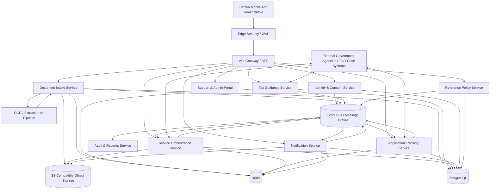
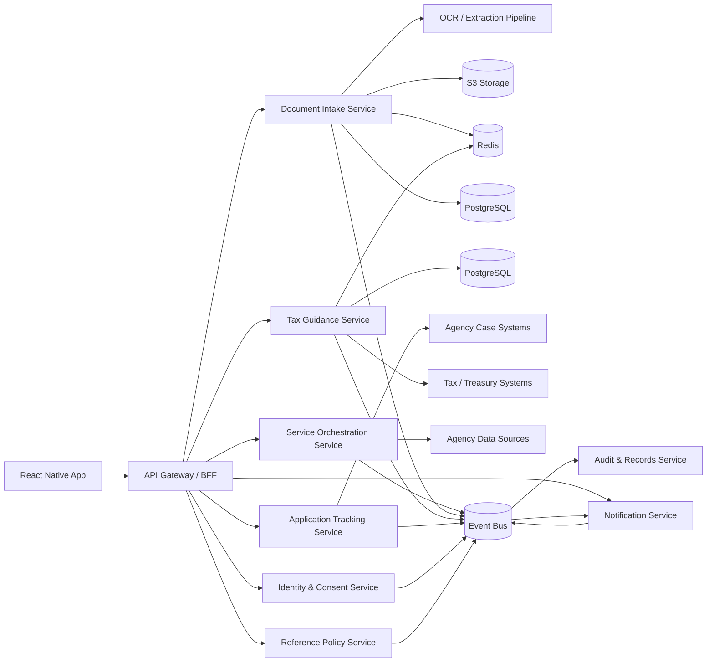
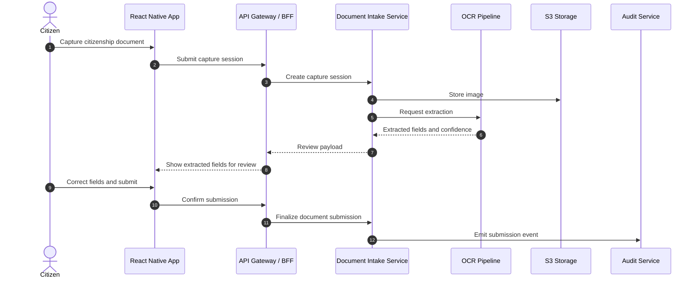
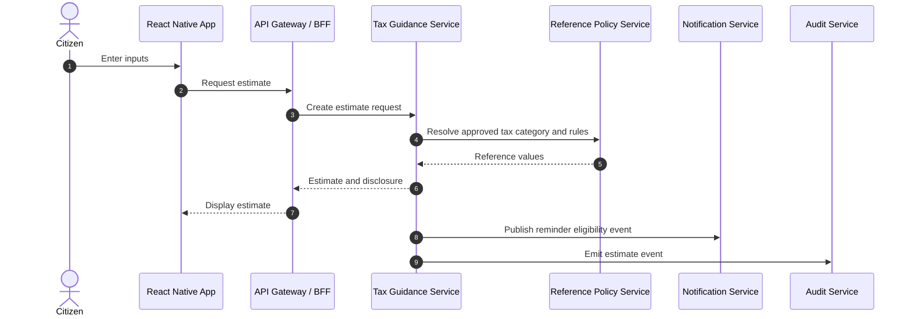
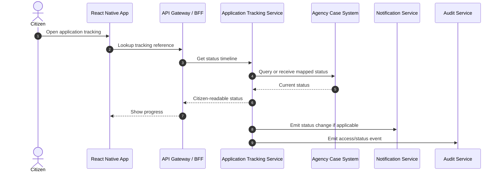
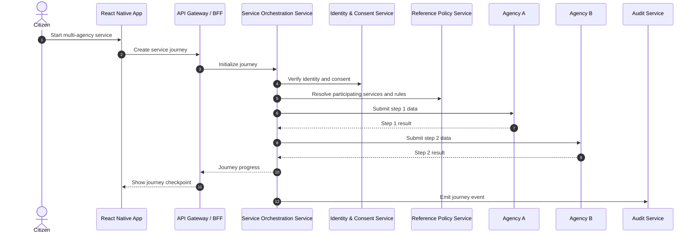
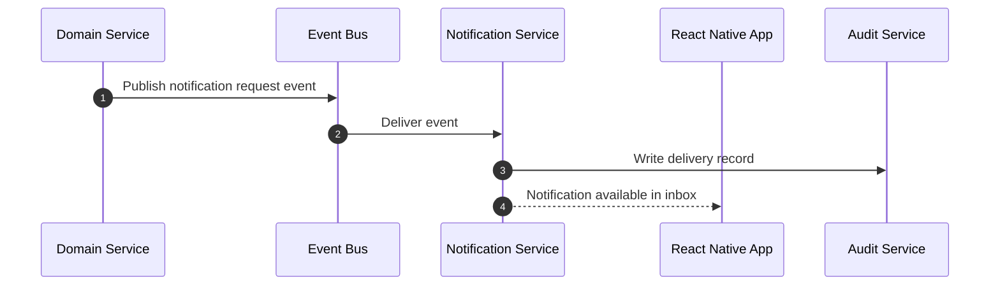
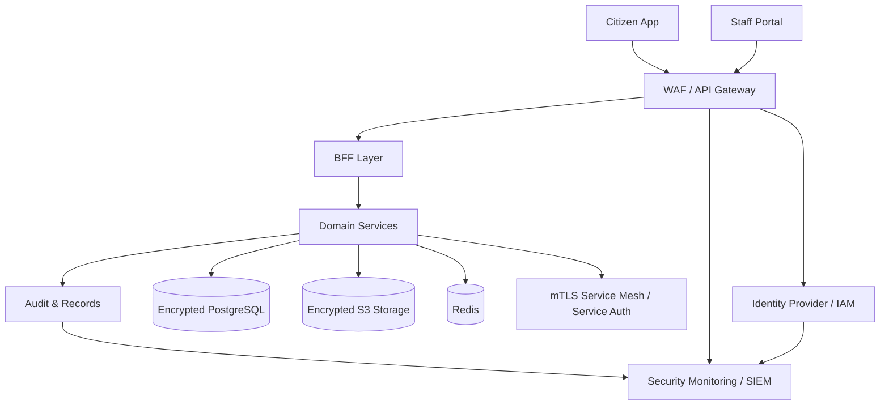
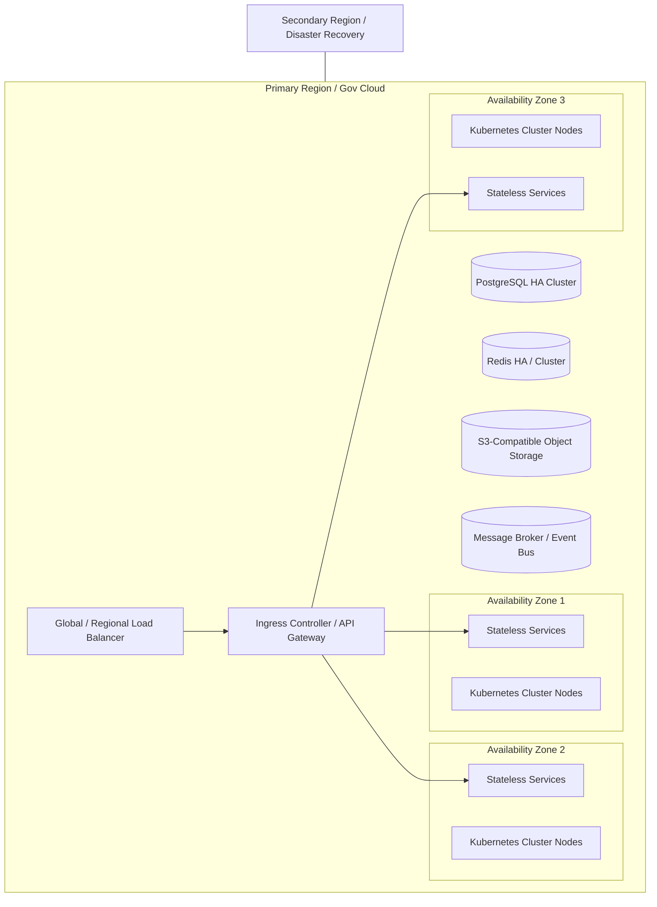

# Production Architecture

## Program
Nagarik App Enhancement Program for Nepal

## Input Artifacts
- Product Requirements Document for Nagarik App enhancements
- Domain model based on Domain-Driven Design

## Architecture Goals
- Support 10 million users with horizontal scalability
- Provide high availability for citizen-facing government services
- Operate within secure government infrastructure constraints
- Keep domains independent and governable across agencies
- Support OCR and document extraction as a first-class capability
- Maintain clear auditability, privacy, and regulatory alignment

## Architectural Principles
- Separate user experience, domain logic, and integration concerns.
- Align service boundaries to bounded contexts from the domain model.
- Use asynchronous processing for long-running or variable-latency tasks.
- Treat shared reference data as governed master data, not duplicated local state.
- Prefer stateless services behind horizontally scalable load balancers.
- Minimize synchronous coupling across agency systems.
- Use secure-by-default patterns for identity, transport, storage, and audit.
- Preserve government control over data residency, access, and records.

## Technology Constraints
- Frontend: React Native
- Backend: FastAPI
- Database: PostgreSQL
- Cache: Redis
- Object Storage: S3-compatible storage
- AI: OCR and document extraction

---

# 1. High-Level Architecture

## Overview
The solution should be implemented as a service-oriented architecture with a React Native mobile client, an API gateway or backend-for-frontend layer, domain-aligned FastAPI services, PostgreSQL for transactional persistence, Redis for caching and job coordination, S3-compatible storage for documents and artifacts, and an asynchronous AI extraction pipeline for OCR and document understanding.

## Recommended Style
A modular microservices architecture is the best fit for the stated constraints and scale. A single deployable monolith would be simpler initially, but the PRD includes multiple independent business capabilities, cross-agency orchestration, document processing, and government-scale availability requirements. The domains are sufficiently distinct to justify service boundaries while still allowing shared infrastructure and governance.

## Logical Architecture

## High-Level Components
- React Native mobile application for citizen interaction.
- API gateway or BFF to centralize authentication enforcement, request shaping, and client-specific aggregation.
- Identity and Consent Service for citizen profile, consent, and preferences.
- Document Intake Service for scan capture, review, and submission.
- Tax Guidance Service for estimates, guidance, and advisory outputs.
- Application Tracking Service for status visibility and history.
- Service Orchestration Service for cross-agency journeys and data reuse.
- Notification Service for citizen inbox and notice lifecycle.
- Reference Policy Service for approved vocabularies and status/category definitions.
- Audit and Records Service for immutable compliance logging.
- Asynchronous OCR and extraction pipeline using managed or self-hosted AI components.
- Event bus for decoupled domain event propagation and notification triggering.

## High-Level Decisions and Rationale
| Decision | Rationale |
|---|---|
| Use service-aligned domains instead of a single shared backend | The PRD contains distinct business capabilities with different lifecycles, compliance rules, and scaling profiles. |
| Use asynchronous processing for OCR and cross-agency workflows | Document extraction and inter-agency calls are variable-latency and should not block the citizen experience. |
| Use a BFF/API gateway in front of domain services | A mobile client benefits from request aggregation, response shaping, and centralized security controls. |
| Use PostgreSQL per domain service or per isolated service schema | Transactional consistency is needed, but shared databases should be avoided to preserve ownership boundaries. |
| Use Redis for caching, rate limiting, session-like ephemeral state, and job coordination | It improves responsiveness and supports high-throughput operational patterns without overloading PostgreSQL. |
| Use S3-compatible storage for documents and extraction artifacts | Citizenship documents and evidence packages are large objects that do not belong in relational storage. |
| Use an event bus for notifications and cross-service signals | This reduces coupling and supports scale, auditability, and extensibility. |

---

# 2. Service Architecture

## Service Decomposition
The recommended services align to the bounded contexts in the domain model.

### 2.1 Identity & Consent Service
**Responsibilities**
- Citizen profile linkage
- Consent records
- Notification preferences
- Authorization scope management

**Data owned**
- Citizen, identity reference, consent record, communication preference

**Notes**
- This service should integrate with national identity or authentication sources rather than replacing them.

### 2.2 Document Intake Service
**Responsibilities**
- Capture document images
- Orchestrate OCR/extraction requests
- Present extracted fields for review
- Manage submission history and quality checks

**Data owned**
- Capture sessions, document metadata, extraction reviews, submission records

**Notes**
- This service should isolate the document lifecycle from case processing.
- Large files and extraction artifacts should be stored in S3-compatible storage.

### 2.3 Tax Guidance Service
**Responsibilities**
- Tax estimation
- Calculation disclosure
- Due-date guidance
- Payment guidance and reminders

**Data owned**
- Tax estimate, tax obligation snapshot, calculation rule snapshot, disclosure outputs

**Notes**
- Treat estimates as advisory unless the business authority defines otherwise.

### 2.4 Application Tracking Service
**Responsibilities**
- Citizen-visible application status
- Milestone history
- Tracking reference management
- Status translation from agency terminology

**Data owned**
- Application tracking view, status timeline, milestone mapping, action required flags

**Notes**
- The service should not own the agency’s internal workflow engine.

### 2.5 Service Orchestration Service
**Responsibilities**
- Cross-agency journey management
- Handoff sequencing
- Data reuse orchestration
- Progress checkpoints

**Data owned**
- Service journey, handoff record, sharing authorization, reused data package metadata

**Notes**
- This is the coordinating domain and should not be conflated with workflow engines inside partner agencies.

### 2.6 Notification Service
**Responsibilities**
- Official citizen inbox
- Notification categorization
- Read state
- Delivery record and history

**Data owned**
- Notification, thread, delivery record, read receipt

**Notes**
- All domain services should publish notification-worthy events rather than directly writing citizen inbox records.

### 2.7 Reference Policy Service
**Responsibilities**
- Service catalog
- Status taxonomy
- Document types
- Tax categories
- Notification categories
- Agency participation rules

**Data owned**
- Approved reference entities and versioned policy records

**Notes**
- This should act as a governed master-data service.

### 2.8 Audit & Records Service
**Responsibilities**
- Immutable event logging
- Access traceability
- Submission evidence
- Retention and oversight support

**Data owned**
- Audit events, access logs, evidence packages, retention metadata

**Notes**
- This service should receive events from all other services and be append-only in nature.

## Service Interaction Patterns
- Synchronous REST APIs for citizen-request/response interactions.
- Asynchronous events for status changes, notice triggers, extraction completion, and audit emission.
- Internal commands within a service for orchestration of local use cases.
- Idempotent APIs for submission, notification creation, and cross-agency handoffs.

## Service Boundary Recommendations
- Keep document intake, tax guidance, application tracking, orchestration, and notifications as separate deployable services.
- Keep identity and reference policy as supporting services with strict governance.
- Keep audit and records separate to ensure compliance and immutability.
- Do not share one service database across multiple bounded contexts.

## Service Ownership Model
- Each service should have a clear product owner and technical owner.
- Cross-agency service orchestration should have a governance owner because it spans institutional boundaries.
- Reference policy updates should follow formal change control because they affect multiple contexts.

---

# 3. Integration Architecture

## Integration Principles
- Prefer API-based integration for real-time citizen interactions.
- Prefer event-driven integration for downstream notifications, audit, and workflow propagation.
- Use well-defined contracts and versioned schemas.
- Use anti-corruption layers when integrating with agency legacy systems.
- Avoid direct database coupling to external government systems.

## Internal Integration
### Synchronous APIs
- Mobile app to BFF/API gateway
- BFF to domain services
- Domain services to reference policy for lookups
- Domain services to identity service for identity and consent checks

### Asynchronous Events
- Document extracted event
- Tax estimate created event
- Application status changed event
- Service journey advanced event
- Notification requested event
- Audit event emitted

## External Integration
### Government Systems
- National identity or authentication sources
- Agency case management systems
- Tax and treasury systems
- Approved payment channels
- Agency document repositories where applicable

### Integration Pattern
Use an integration layer or adapter per external system class. Each adapter should translate between the external system’s schema and the internal canonical domain contract.

## Integration Architecture Diagram

## Integration Decisions and Rationale
| Decision | Rationale |
|---|---|
| Use a BFF as the primary integration point for the mobile app | Reduces client complexity and allows tailored mobile responses. |
| Use event-driven integration for notifications and audit | Supports scale, resilience, and eventual consistency where acceptable. |
| Use adapters for external government systems | Prevents external schema volatility from leaking into domain models. |
| Use idempotency keys for submission endpoints | Prevents duplicate applications, duplicate scans, and duplicate notifications. |
| Version all public contracts | Government systems evolve slowly; contract versioning reduces breakage. |

## Canonical Integration Events
- DocumentSubmitted
- DocumentExtractionCompleted
- TaxEstimateCreated
- ApplicationStatusUpdated
- ServiceJourneyCreated
- ServiceJourneyProgressed
- NotificationRequested
- CitizenConsentUpdated
- PolicyReferenceUpdated
- AuditRecordCreated

---

# 4. Data Flow Diagrams

## 4.1 Document Scanning and Extraction Flow

## 4.2 Tax Estimation Flow

## 4.3 Application Tracking Flow

## 4.4 Cross-Agency Service Orchestration Flow

## 4.5 Notification Flow

## Data Flow Decisions and Rationale
| Decision | Rationale |
|---|---|
| Use a dedicated OCR flow with storage and extraction stages | Document processing is long-running and must be decoupled from the user session. |
| Return review payloads before final document acceptance | Citizens must be able to validate extracted fields before submission. |
| Separate notification triggering from notification rendering | The source domain should not own the inbox experience. |
| Treat cross-agency journey state as a first-class flow | Multi-agency services need explicit progress checkpoints and auditability. |

---

# 5. Security Architecture

## Security Objectives
- Protect citizen identity, document, tax, and application data.
- Prevent unauthorized access, tampering, and spoofing.
- Provide traceability for all sensitive actions.
- Support government-grade governance and compliance.

## Security Design Principles
- Zero trust between services.
- Least privilege for users, operators, services, and administrators.
- Strong authentication for citizens and privileged users.
- End-to-end encryption in transit.
- Encryption at rest for databases and object storage.
- Immutable audit logging for regulated actions.
- Explicit consent or lawful basis where data sharing occurs.

## Security Controls
### Identity and Access Management
- OAuth2/OIDC-based citizen authentication through government-approved identity providers.
- Role-based access control for support staff, officers, and administrators.
- Service-to-service authentication using mutual TLS and short-lived credentials.
- Fine-grained authorization scopes for document access, status lookup, and cross-agency sharing.

### Data Protection
- TLS for all client, service, and integration traffic.
- Encryption at rest for PostgreSQL and S3-compatible storage.
- Sensitive fields tokenized or masked in logs and user interfaces where appropriate.
- Separate data retention and deletion controls by domain and legal category.

### Application Security
- Input validation and output encoding in API and mobile layers.
- Rate limiting and bot protection at the gateway.
- Idempotency controls for submissions and notifications.
- Secure file upload validation for document images and attachments.
- Malware scanning or content screening for uploaded files where required by policy.

### Audit and Oversight
- Audit every access to documents, tax guidance records, and tracking data.
- Log consent changes, data-sharing authorizations, and administrative changes.
- Preserve tamper-evident records for regulatory review and complaint handling.

### Threats and Mitigations
| Threat | Mitigation |
|---|---|
| Unauthorized access to citizen documents | Strong auth, authorization scopes, encryption, and audit trails |
| Fraudulent notification spoofing | Official notification service, signed delivery records, clear trust markers |
| Data leakage across agencies | Consent controls, least privilege, purpose limitation, adapter boundaries |
| Abuse of OCR upload endpoints | Rate limiting, file validation, virus scanning, and storage isolation |
| Inconsistent privileged access | Central IAM, role governance, periodic access review |

## Security Architecture Diagram

## Security Decisions and Rationale
| Decision | Rationale |
|---|---|
| Use a gateway plus IAM as the first security control | Centralizes authentication, throttling, and request inspection. |
| Use service-to-service mTLS | Reduces risk of unauthorized lateral movement. |
| Encrypt all persistent stores | Government data sensitivity requires strong confidentiality protections. |
| Keep audit separate from operational stores | Audit evidence must remain durable and less mutable than business data. |
| Apply least privilege to agency integrations | Cross-agency data sharing must be tightly bounded. |

---

# 6. Deployment Architecture

## Deployment Goals
- High availability for citizen services
- Horizontal scale for 10 million users
- Operational resilience during peak demand
- Secure government hosting with controlled access
- Clear separation of environments and data

## Recommended Runtime Topology
Deploy each service in containers on a government-approved Kubernetes platform or equivalent orchestrator in a secure government cloud or data center environment. Use multiple availability zones or physically isolated fault domains where the infrastructure permits.

## Deployment Topology Diagram

## Environment Segmentation
- Development environment for engineer productivity.
- Test/QA environment for functional and integration testing.
- Staging/pre-production environment mirroring production topology.
- Production environment with governed access and stronger controls.
- Optional disaster recovery environment in a separate region or fault domain.

## Scaling Strategy
### Stateless Services
- Scale horizontally based on CPU, latency, and request rate.
- Keep domain services stateless where possible.

### PostgreSQL
- Use primary/replica or clustered HA configuration.
- Partition or shard where required by service load and data isolation needs.
- Use read replicas for read-heavy workloads such as application tracking and notification inbox reads.

### Redis
- Use cluster or sentinel-based HA depending on operational constraints.
- Use for caching, ephemeral workflow state, and rate-limiting.

### Object Storage
- Use bucket policies, lifecycle rules, and immutability controls for regulated content.
- Store uploads, extracted artifacts, and evidence packages separately by domain and sensitivity where needed.

### Eventing
- Use a durable broker with retry, dead-letter handling, and consumer scaling.
- Separate high-volume notification flows from lower-volume administrative events if needed.

## Availability Strategy
- Multi-AZ deployment for all stateless services.
- HA database configuration with tested failover.
- Rolling deployments with health checks and readiness gates.
- Graceful degradation for non-critical features such as analytics or advisory recommendations.
- Queue-based buffering for extraction and notification spikes.

## Disaster Recovery Strategy
- Define RPO and RTO by domain criticality.
- Prioritize identity, tracking, and notification recovery.
- Maintain backup and restore testing for PostgreSQL and object storage.
- Replicate critical configuration and reference policy artifacts.

## Deployment Decisions and Rationale
| Decision | Rationale |
|---|---|
| Use containerized stateless services | Supports horizontal scalability and consistent deployment across environments. |
| Use multi-AZ high availability | Required for government-grade resilience and user trust. |
| Separate production and non-production environments | Reduces operational risk and supports controlled validation. |
| Use HA for PostgreSQL and Redis | These are core runtime dependencies and must not be single points of failure. |
| Include a disaster recovery posture | Public services must have recovery plans for major outages or regional failures. |

---

# 7. Capacity and Scale Considerations

## Scale Assumptions
- 10 million registered users
- Uneven traffic with strong peaks around deadlines, announcements, and campaign launches
- Mixed read-heavy and event-driven workloads
- Document upload and OCR workload bursts

## Capacity Implications
- The mobile app and BFF must be optimized for read-heavy traffic.
- Application tracking and notification reads are expected to be high-volume and should be cached where safe.
- OCR workloads should be queued and processed asynchronously.
- Cross-agency orchestration should be designed for eventual consistency and retry.

## Performance Decisions
- Cache reference policy and frequently read citizen-visible summaries.
- Use pagination and partial loading for history and notification lists.
- Avoid large synchronous payloads in mobile interactions.
- Use asynchronous callbacks or polling refresh for long-running extraction and journey steps.

---

# 8. Summary of Key Architecture Decisions
1. Use a service-oriented, domain-aligned architecture rather than a shared monolith.
2. Put a BFF/API gateway in front of the mobile client.
3. Make OCR and document extraction asynchronous.
4. Keep domain services independently deployable with isolated ownership.
5. Use PostgreSQL for transactional state, Redis for caching and ephemeral coordination, and S3-compatible storage for documents.
6. Use an event bus to decouple notifications, audit, and workflow propagation.
7. Separate supporting contexts for identity/consent, reference policy, and audit/records.
8. Design for multi-AZ high availability and disaster recovery.
9. Enforce zero-trust and least-privilege security across all layers.
10. Use adapters for external government systems to protect domain models from legacy coupling.

## Final Recommendation
Proceed with a domain-aligned service architecture on the specified stack. This is the most suitable approach for a government-scale citizen platform that must support high availability, secure cross-agency interactions, document intelligence, and long-term maintainability.
