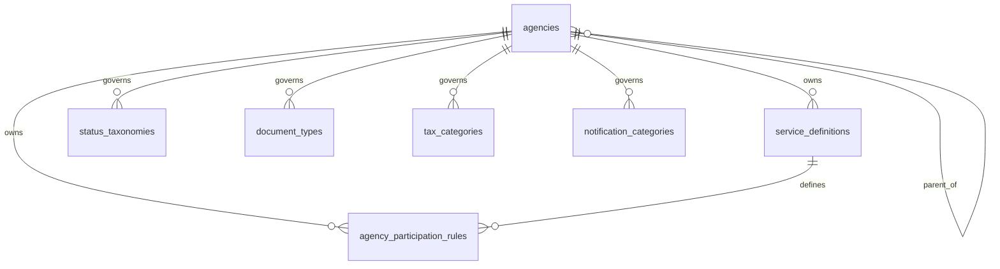
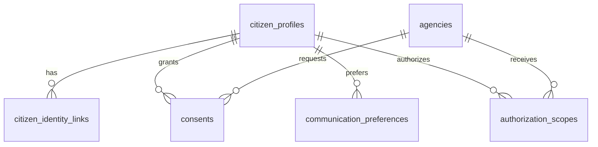
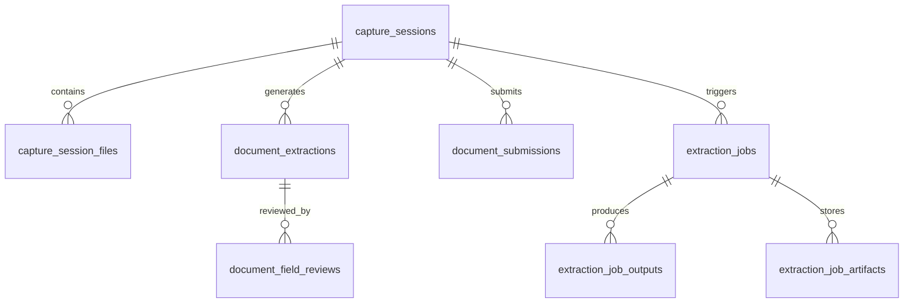
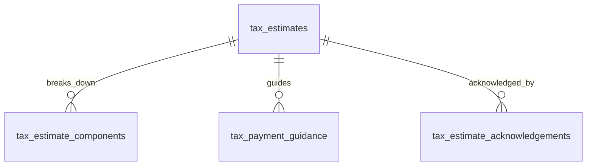
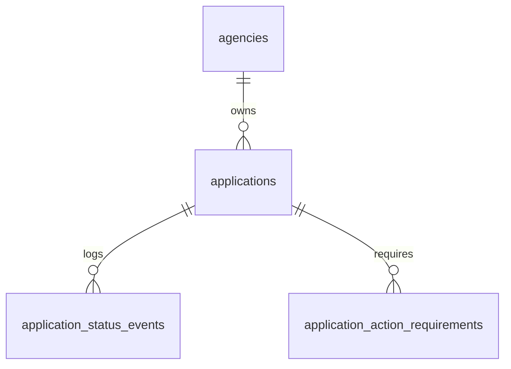
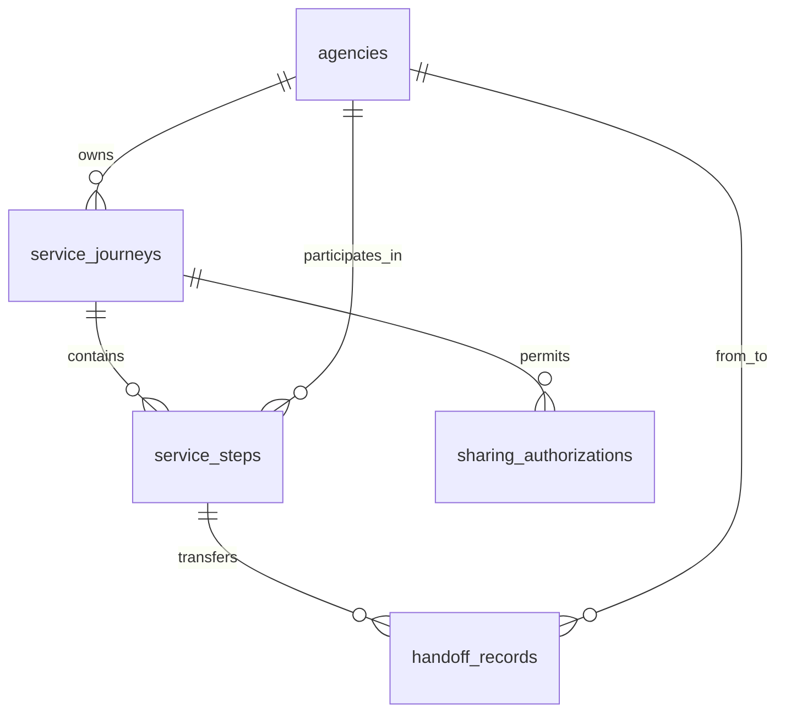
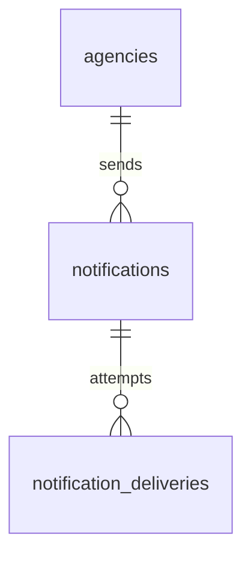
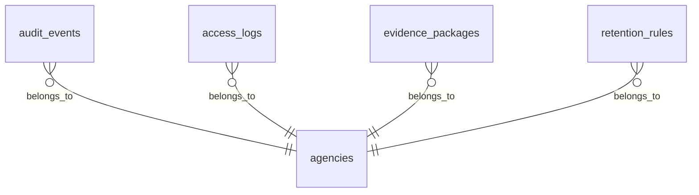

# Database Design

## Program Context
This database design decomposes the Nagarik App platform into PostgreSQL schemas aligned to the service catalog and bounded contexts.

## Design Goals
- UUID primary keys
- snake_case naming
- standard audit fields on every table
- soft delete support
- multi-agency support
- clear service ownership boundaries
- production-grade indexing and referential structure

## Design Conventions
### Primary Key Standard
- Every table uses `id uuid primary key default gen_random_uuid()`.

### Audit Field Standard
- Every table includes:
  - `created_at timestamptz not null default now()`
  - `updated_at timestamptz not null default now()`
  - `deleted_at timestamptz null`
  - `created_by_actor_id uuid null`
  - `updated_by_actor_id uuid null`

### Soft Delete Standard
- Soft delete is implemented with `deleted_at`.
- Active-row unique constraints and indexes should be partial, for example `WHERE deleted_at IS NULL`.

### Multi-Agency Standard
- Multi-agency ownership is represented with `agency_id uuid not null` on agency-scoped tables.
- All agency references point to `reference_policy.agencies(id)`.
- Shared platform tables may use `agency_id` as nullable only when the row is global and not agency-owned.

### Relationship Standard
- Same-schema relationships use physical foreign keys.
- Cross-service relationships are modeled as logical UUID references only, unless the deployment intentionally uses a single database with schema namespaces.
- Business status values are stored as short text codes and governed by `reference_policy`.

### Recommended PostgreSQL Extensions
- `pgcrypto` for UUID generation
- `citext` if case-insensitive identifiers are required for selected lookups

---

# 1. Reference Policy Schema

## Schema Name
`reference_policy`

## Purpose
Owns agencies, approved reference values, service definitions, document types, tax categories, notification categories, status taxonomies, and agency participation rules.

## Tables

### 1.1 `reference_policy.agencies`
**Purpose**
Stores the authoritative registry of participating agencies.

**Columns**
| Column | Type | Constraints |
|---|---|---|
| id | uuid | PK, default `gen_random_uuid()` |
| code | text | not null, unique active, check length > 0 |
| name | text | not null |
| agency_type | text | not null, check `agency_type in ('ministry','department','authority','local_government','other')` |
| parent_agency_id | uuid | null, self-FK |
| status | text | not null, check `status in ('active','inactive')` |
| created_at | timestamptz | not null, default `now()` |
| updated_at | timestamptz | not null, default `now()` |
| deleted_at | timestamptz | null |
| created_by_actor_id | uuid | null |
| updated_by_actor_id | uuid | null |

**Indexes**
- `uq_agencies_code_active` on `(code)` where `deleted_at is null`
- `ix_agencies_parent_agency_id` on `(parent_agency_id)` where `deleted_at is null`
- `ix_agencies_status` on `(status)` where `deleted_at is null`

**Relationships**
- Self-referencing parent-child hierarchy via `parent_agency_id`.
- Referenced by all agency-scoped tables as `agency_id`.

### 1.2 `reference_policy.service_definitions`
**Purpose**
Stores approved service catalog entries and ownership metadata.

**Columns**
| Column | Type | Constraints |
|---|---|---|
| id | uuid | PK |
| agency_id | uuid | not null, FK to `reference_policy.agencies(id)` |
| service_code | text | not null, unique active |
| service_name | text | not null |
| description | text | null |
| service_status | text | not null, check `service_status in ('draft','active','retired')` |
| version | integer | not null, check `version > 0` |
| effective_from | date | not null |
| effective_to | date | null |
| created_at | timestamptz | not null |
| updated_at | timestamptz | not null |
| deleted_at | timestamptz | null |
| created_by_actor_id | uuid | null |
| updated_by_actor_id | uuid | null |

**Indexes**
- `uq_service_definitions_code_active` on `(service_code)` where `deleted_at is null`
- `ix_service_definitions_agency_id` on `(agency_id)` where `deleted_at is null`
- `ix_service_definitions_status` on `(service_status)` where `deleted_at is null`

**Relationships**
- Belongs to one agency.
- Referenced by orchestration, tracking, and notification rows.

### 1.3 `reference_policy.status_taxonomies`
**Purpose**
Stores governed status codes and labels used across services.

**Columns**
| Column | Type | Constraints |
|---|---|---|
| id | uuid | PK |
| agency_id | uuid | null, FK to `reference_policy.agencies(id)` |
| taxonomy_domain | text | not null, check `taxonomy_domain in ('application','journey','notification','document','tax')` |
| status_code | text | not null |
| status_label | text | not null |
| status_description | text | null |
| display_order | integer | not null, default 0 |
| is_terminal | boolean | not null, default false |
| created_at | timestamptz | not null |
| updated_at | timestamptz | not null |
| deleted_at | timestamptz | null |
| created_by_actor_id | uuid | null |
| updated_by_actor_id | uuid | null |

**Indexes**
- `uq_status_taxonomies_domain_code_active` on `(taxonomy_domain, status_code)` where `deleted_at is null`
- `ix_status_taxonomies_domain_order` on `(taxonomy_domain, display_order)` where `deleted_at is null`

**Relationships**
- Provides governed status vocabularies for application tracking, orchestration, documents, tax, and notifications.

### 1.4 `reference_policy.document_types`
**Purpose**
Stores approved document type definitions used for capture and validation.

**Columns**
| Column | Type | Constraints |
|---|---|---|
| id | uuid | PK |
| agency_id | uuid | null, FK to `reference_policy.agencies(id)` |
| document_type_code | text | not null, unique active |
| document_type_name | text | not null |
| description | text | null |
| requires_front_back | boolean | not null, default false |
| is_active | boolean | not null, default true |
| created_at | timestamptz | not null |
| updated_at | timestamptz | not null |
| deleted_at | timestamptz | null |
| created_by_actor_id | uuid | null |
| updated_by_actor_id | uuid | null |

**Indexes**
- `uq_document_types_code_active` on `(document_type_code)` where `deleted_at is null`
- `ix_document_types_is_active` on `(is_active)` where `deleted_at is null`

**Relationships**
- Referenced logically by document intake tables.

### 1.5 `reference_policy.tax_categories`
**Purpose**
Stores approved tax category definitions.

**Columns**
| Column | Type | Constraints |
|---|---|---|
| id | uuid | PK |
| agency_id | uuid | null, FK to `reference_policy.agencies(id)` |
| tax_category_code | text | not null, unique active |
| tax_category_name | text | not null |
| description | text | null |
| effective_from | date | not null |
| effective_to | date | null |
| is_active | boolean | not null, default true |
| created_at | timestamptz | not null |
| updated_at | timestamptz | not null |
| deleted_at | timestamptz | null |
| created_by_actor_id | uuid | null |
| updated_by_actor_id | uuid | null |

**Indexes**
- `uq_tax_categories_code_active` on `(tax_category_code)` where `deleted_at is null`
- `ix_tax_categories_is_active` on `(is_active)` where `deleted_at is null`

**Relationships**
- Referenced logically by tax guidance tables.

### 1.6 `reference_policy.notification_categories`
**Purpose**
Stores official notification category definitions.

**Columns**
| Column | Type | Constraints |
|---|---|---|
| id | uuid | PK |
| agency_id | uuid | null, FK to `reference_policy.agencies(id)` |
| category_code | text | not null, unique active |
| category_name | text | not null |
| severity | text | not null, check `severity in ('info','warning','action_required','deadline')` |
| description | text | null |
| is_active | boolean | not null, default true |
| created_at | timestamptz | not null |
| updated_at | timestamptz | not null |
| deleted_at | timestamptz | null |
| created_by_actor_id | uuid | null |
| updated_by_actor_id | uuid | null |

**Indexes**
- `uq_notification_categories_code_active` on `(category_code)` where `deleted_at is null`
- `ix_notification_categories_severity` on `(severity)` where `deleted_at is null`

**Relationships**
- Referenced logically by the notification service.

### 1.7 `reference_policy.agency_participation_rules`
**Purpose**
Stores which agencies participate in which services and under what role.

**Columns**
| Column | Type | Constraints |
|---|---|---|
| id | uuid | PK |
| agency_id | uuid | not null, FK to `reference_policy.agencies(id)` |
| service_definition_id | uuid | not null, logical FK to `reference_policy.service_definitions(id)` |
| participating_agency_id | uuid | not null, FK to `reference_policy.agencies(id)` |
| participation_role | text | not null, check `participation_role in ('lead','contributor','verifier','consumer')` |
| required_flag | boolean | not null, default false |
| effective_from | date | not null |
| effective_to | date | null |
| created_at | timestamptz | not null |
| updated_at | timestamptz | not null |
| deleted_at | timestamptz | null |
| created_by_actor_id | uuid | null |
| updated_by_actor_id | uuid | null |

**Indexes**
- `uq_agency_participation_rules_active` on `(service_definition_id, participating_agency_id, participation_role)` where `deleted_at is null`
- `ix_agency_participation_rules_agency_id` on `(agency_id)` where `deleted_at is null`

**Relationships**
- Connects a service definition to participating agencies.

---

# 2. Identity Schema

## Schema Name
`identity`

## Purpose
Owns citizen profile linkage, identity references, consent records, communication preferences, and authorization scopes.

## Tables

### 2.1 `identity.citizen_profiles`
**Purpose**
Stores the canonical citizen profile used by platform services.

**Columns**
| Column | Type | Constraints |
|---|---|---|
| id | uuid | PK |
| national_identity_ref | text | not null, unique active |
| full_name | text | not null |
| date_of_birth | date | null |
| phone_number | text | null |
| email_address | text | null |
| preferred_language_code | text | not null, default `'ne'` |
| profile_status | text | not null, check `profile_status in ('active','suspended','merged')` |
| created_at | timestamptz | not null |
| updated_at | timestamptz | not null |
| deleted_at | timestamptz | null |
| created_by_actor_id | uuid | null |
| updated_by_actor_id | uuid | null |

**Indexes**
- `uq_citizen_profiles_national_identity_ref_active` on `(national_identity_ref)` where `deleted_at is null`
- `ix_citizen_profiles_phone_number` on `(phone_number)` where `deleted_at is null`
- `ix_citizen_profiles_email_address` on `(email_address)` where `deleted_at is null`

**Relationships**
- Parent to consents, communication preferences, authorization scopes, and identity links.

### 2.2 `identity.citizen_identity_links`
**Purpose**
Stores links to trusted external identity providers.

**Columns**
| Column | Type | Constraints |
|---|---|---|
| id | uuid | PK |
| citizen_profile_id | uuid | not null, FK to `identity.citizen_profiles(id)` |
| identity_provider_code | text | not null |
| provider_subject_id | text | not null |
| assurance_level | text | not null, check `assurance_level in ('low','substantial','high')` |
| verified_at | timestamptz | not null |
| source_payload | jsonb | null |
| created_at | timestamptz | not null |
| updated_at | timestamptz | not null |
| deleted_at | timestamptz | null |
| created_by_actor_id | uuid | null |
| updated_by_actor_id | uuid | null |

**Indexes**
- `uq_citizen_identity_links_provider_subject_active` on `(identity_provider_code, provider_subject_id)` where `deleted_at is null`
- `ix_citizen_identity_links_citizen_profile_id` on `(citizen_profile_id)` where `deleted_at is null`

**Relationships**
- Many links belong to one citizen profile.

### 2.3 `identity.consents`
**Purpose**
Stores citizen consent records and lawful-basis acknowledgments.

**Columns**
| Column | Type | Constraints |
|---|---|---|
| id | uuid | PK |
| citizen_profile_id | uuid | not null, FK to `identity.citizen_profiles(id)` |
| requesting_agency_id | uuid | null, FK to `reference_policy.agencies(id)` |
| purpose_code | text | not null |
| consent_status | text | not null, check `consent_status in ('granted','revoked','expired')` |
| lawful_basis | text | null |
| granted_at | timestamptz | null |
| revoked_at | timestamptz | null |
| expires_at | timestamptz | null |
| source_channel | text | not null, check `source_channel in ('mobile_app','staff_assisted','integration')` |
| created_at | timestamptz | not null |
| updated_at | timestamptz | not null |
| deleted_at | timestamptz | null |
| created_by_actor_id | uuid | null |
| updated_by_actor_id | uuid | null |

**Indexes**
- `ix_consents_citizen_profile_id` on `(citizen_profile_id)` where `deleted_at is null`
- `ix_consents_requesting_agency_id` on `(requesting_agency_id)` where `deleted_at is null`
- `ix_consents_purpose_status` on `(purpose_code, consent_status)` where `deleted_at is null`

**Relationships**
- Many consents belong to one citizen profile.
- Optional linkage to a requesting agency.

### 2.4 `identity.communication_preferences`
**Purpose**
Stores citizen communication preferences for notifications and contact channels.

**Columns**
| Column | Type | Constraints |
|---|---|---|
| id | uuid | PK |
| citizen_profile_id | uuid | not null, FK to `identity.citizen_profiles(id)` |
| channel | text | not null, check `channel in ('push','sms','email','in_app')` |
| enabled_flag | boolean | not null, default true |
| preferred_language_code | text | not null |
| quiet_hours_start | time | null |
| quiet_hours_end | time | null |
| created_at | timestamptz | not null |
| updated_at | timestamptz | not null |
| deleted_at | timestamptz | null |
| created_by_actor_id | uuid | null |
| updated_by_actor_id | uuid | null |

**Indexes**
- `uq_communication_preferences_citizen_channel_active` on `(citizen_profile_id, channel)` where `deleted_at is null`
- `ix_communication_preferences_enabled_flag` on `(enabled_flag)` where `deleted_at is null`

**Relationships**
- Many preferences belong to one citizen profile.

### 2.5 `identity.authorization_scopes`
**Purpose**
Stores citizen-granted authorization scopes for agency-specific or service-specific access.

**Columns**
| Column | Type | Constraints |
|---|---|---|
| id | uuid | PK |
| citizen_profile_id | uuid | not null, FK to `identity.citizen_profiles(id)` |
| agency_id | uuid | not null, FK to `reference_policy.agencies(id)` |
| scope_code | text | not null |
| scope_status | text | not null, check `scope_status in ('active','revoked','expired')` |
| granted_at | timestamptz | not null |
| expires_at | timestamptz | null |
| created_at | timestamptz | not null |
| updated_at | timestamptz | not null |
| deleted_at | timestamptz | null |
| created_by_actor_id | uuid | null |
| updated_by_actor_id | uuid | null |

**Indexes**
- `uq_authorization_scopes_active` on `(citizen_profile_id, agency_id, scope_code)` where `deleted_at is null`
- `ix_authorization_scopes_agency_id` on `(agency_id)` where `deleted_at is null`

**Relationships**
- Many scopes belong to one citizen profile.
- Each scope is tied to one agency.

---

# 3. Document Intake Schema

## Schema Name
`document_intake`

## Purpose
Owns document capture sessions, uploaded files, review state, extraction submission state, and document submission records.

## Tables

### 3.1 `document_intake.capture_sessions`
**Purpose**
Represents a citizen document capture workflow.

**Columns**
| Column | Type | Constraints |
|---|---|---|
| id | uuid | PK |
| agency_id | uuid | not null, FK to `reference_policy.agencies(id)` |
| citizen_profile_id | uuid | not null, logical reference to `identity.citizen_profiles(id)` |
| document_type_id | uuid | not null, logical reference to `reference_policy.document_types(id)` |
| session_status | text | not null, check `session_status in ('draft','capturing','awaiting_review','submitted','rejected','confirmed')` |
| quality_score | numeric(5,2) | null, check `quality_score between 0 and 100` |
| started_at | timestamptz | not null |
| submitted_at | timestamptz | null |
| created_at | timestamptz | not null |
| updated_at | timestamptz | not null |
| deleted_at | timestamptz | null |
| created_by_actor_id | uuid | null |
| updated_by_actor_id | uuid | null |

**Indexes**
- `ix_capture_sessions_agency_id` on `(agency_id)` where `deleted_at is null`
- `ix_capture_sessions_citizen_profile_id` on `(citizen_profile_id)` where `deleted_at is null`
- `ix_capture_sessions_session_status` on `(session_status)` where `deleted_at is null`

**Relationships**
- Parent to capture session files, field reviews, and submissions.

### 3.2 `document_intake.capture_session_files`
**Purpose**
Stores metadata for uploaded document images and supporting files.

**Columns**
| Column | Type | Constraints |
|---|---|---|
| id | uuid | PK |
| capture_session_id | uuid | not null, FK to `document_intake.capture_sessions(id)` |
| file_role | text | not null, check `file_role in ('front','back','supporting','combined')` |
| storage_bucket | text | not null |
| storage_key | text | not null |
| mime_type | text | not null |
| file_size_bytes | bigint | not null, check `file_size_bytes > 0` |
| checksum_sha256 | text | not null |
| page_number | integer | null, check `page_number > 0` |
| sort_order | integer | not null, default 0 |
| created_at | timestamptz | not null |
| updated_at | timestamptz | not null |
| deleted_at | timestamptz | null |
| created_by_actor_id | uuid | null |
| updated_by_actor_id | uuid | null |

**Indexes**
- `ix_capture_session_files_capture_session_id` on `(capture_session_id)` where `deleted_at is null`
- `ix_capture_session_files_storage_key` on `(storage_bucket, storage_key)` where `deleted_at is null`
- `uq_capture_session_files_checksum_active` on `(capture_session_id, checksum_sha256)` where `deleted_at is null`

**Relationships**
- Many files belong to one capture session.

### 3.3 `document_intake.document_extractions`
**Purpose**
Stores citizen-visible extraction results and review state.

**Columns**
| Column | Type | Constraints |
|---|---|---|
| id | uuid | PK |
| capture_session_id | uuid | not null, FK to `document_intake.capture_sessions(id)` |
| ocr_job_id | uuid | not null, logical reference to `ocr.extraction_jobs(id)` |
| extraction_status | text | not null, check `extraction_status in ('pending','completed','failed','needs_review')` |
| extracted_payload | jsonb | not null |
| confidence_score | numeric(5,2) | null, check `confidence_score between 0 and 100` |
| model_version | text | null |
| extracted_at | timestamptz | null |
| created_at | timestamptz | not null |
| updated_at | timestamptz | not null |
| deleted_at | timestamptz | null |
| created_by_actor_id | uuid | null |
| updated_by_actor_id | uuid | null |

**Indexes**
- `ix_document_extractions_capture_session_id` on `(capture_session_id)` where `deleted_at is null`
- `ix_document_extractions_ocr_job_id` on `(ocr_job_id)` where `deleted_at is null`
- `ix_document_extractions_status` on `(extraction_status)` where `deleted_at is null`

**Relationships**
- One extraction belongs to one capture session.
- Linked logically to one OCR job.

### 3.4 `document_intake.document_field_reviews`
**Purpose**
Stores citizen corrections and reviewer decisions for extracted fields.

**Columns**
| Column | Type | Constraints |
|---|---|---|
| id | uuid | PK |
| document_extraction_id | uuid | not null, FK to `document_intake.document_extractions(id)` |
| field_name | text | not null |
| extracted_value | text | null |
| corrected_value | text | null |
| review_status | text | not null, check `review_status in ('accepted','corrected','rejected')` |
| reviewed_at | timestamptz | null |
| created_at | timestamptz | not null |
| updated_at | timestamptz | not null |
| deleted_at | timestamptz | null |
| created_by_actor_id | uuid | null |
| updated_by_actor_id | uuid | null |

**Indexes**
- `ix_document_field_reviews_document_extraction_id` on `(document_extraction_id)` where `deleted_at is null`
- `uq_document_field_reviews_active` on `(document_extraction_id, field_name)` where `deleted_at is null`

**Relationships**
- Many reviews belong to one document extraction.

### 3.5 `document_intake.document_submissions`
**Purpose**
Stores final submission records and downstream service references.

**Columns**
| Column | Type | Constraints |
|---|---|---|
| id | uuid | PK |
| capture_session_id | uuid | not null, FK to `document_intake.capture_sessions(id)` |
| service_journey_id | uuid | null, logical reference to `service_orchestration.service_journeys(id)` |
| submission_status | text | not null, check `submission_status in ('draft','submitted','confirmed','rejected')` |
| extraction_job_id | uuid | null, logical reference to `ocr.extraction_jobs(id)` |
| submitted_at | timestamptz | null |
| confirmed_at | timestamptz | null |
| rejection_reason | text | null |
| created_at | timestamptz | not null |
| updated_at | timestamptz | not null |
| deleted_at | timestamptz | null |
| created_by_actor_id | uuid | null |
| updated_by_actor_id | uuid | null |

**Indexes**
- `uq_document_submissions_capture_session_active` on `(capture_session_id)` where `deleted_at is null`
- `ix_document_submissions_service_journey_id` on `(service_journey_id)` where `deleted_at is null`
- `ix_document_submissions_status` on `(submission_status)` where `deleted_at is null`

**Relationships**
- One submission belongs to one capture session.
- May be linked logically to a service journey and extraction job.

---

# 4. OCR Schema

## Schema Name
`ocr`

## Purpose
Owns extraction job orchestration, inference outputs, confidence metrics, and processing artifacts.

## Tables

### 4.1 `ocr.extraction_jobs`
**Purpose**
Tracks OCR and extraction processing for uploaded documents.

**Columns**
| Column | Type | Constraints |
|---|---|---|
| id | uuid | PK |
| agency_id | uuid | not null, FK to `reference_policy.agencies(id)` |
| capture_session_id | uuid | not null, logical reference to `document_intake.capture_sessions(id)` |
| source_file_id | uuid | not null, logical reference to `document_intake.capture_session_files(id)` |
| job_status | text | not null, check `job_status in ('queued','running','completed','failed','dead_lettered')` |
| model_version | text | not null |
| confidence_score | numeric(5,2) | null, check `confidence_score between 0 and 100` |
| requested_at | timestamptz | not null |
| started_at | timestamptz | null |
| completed_at | timestamptz | null |
| error_code | text | null |
| error_message | text | null |
| created_at | timestamptz | not null |
| updated_at | timestamptz | not null |
| deleted_at | timestamptz | null |
| created_by_actor_id | uuid | null |
| updated_by_actor_id | uuid | null |

**Indexes**
- `ix_extraction_jobs_agency_id` on `(agency_id)` where `deleted_at is null`
- `ix_extraction_jobs_capture_session_id` on `(capture_session_id)` where `deleted_at is null`
- `ix_extraction_jobs_status` on `(job_status)` where `deleted_at is null`
- `ix_extraction_jobs_requested_at` on `(requested_at)` where `deleted_at is null`

**Relationships**
- One job belongs to one document capture session.
- One job processes one source file.

### 4.2 `ocr.extraction_job_outputs`
**Purpose**
Stores extracted fields and structured OCR outputs.

**Columns**
| Column | Type | Constraints |
|---|---|---|
| id | uuid | PK |
| extraction_job_id | uuid | not null, FK to `ocr.extraction_jobs(id)` |
| output_status | text | not null, check `output_status in ('generated','reviewed','superseded')` |
| structured_payload | jsonb | not null |
| field_count | integer | not null, check `field_count >= 0` |
| output_hash | text | not null |
| created_at | timestamptz | not null |
| updated_at | timestamptz | not null |
| deleted_at | timestamptz | null |
| created_by_actor_id | uuid | null |
| updated_by_actor_id | uuid | null |

**Indexes**
- `uq_extraction_job_outputs_active` on `(extraction_job_id)` where `deleted_at is null`
- `ix_extraction_job_outputs_status` on `(output_status)` where `deleted_at is null`

**Relationships**
- One output belongs to one extraction job.

### 4.3 `ocr.extraction_job_artifacts`
**Purpose**
Stores links to images, intermediate artifacts, and model outputs.

**Columns**
| Column | Type | Constraints |
|---|---|---|
| id | uuid | PK |
| extraction_job_id | uuid | not null, FK to `ocr.extraction_jobs(id)` |
| artifact_type | text | not null, check `artifact_type in ('input_image','preprocessed_image','confidence_report','debug_bundle')` |
| storage_bucket | text | not null |
| storage_key | text | not null |
| mime_type | text | not null |
| file_size_bytes | bigint | not null, check `file_size_bytes > 0` |
| checksum_sha256 | text | not null |
| created_at | timestamptz | not null |
| updated_at | timestamptz | not null |
| deleted_at | timestamptz | null |
| created_by_actor_id | uuid | null |
| updated_by_actor_id | uuid | null |

**Indexes**
- `ix_extraction_job_artifacts_extraction_job_id` on `(extraction_job_id)` where `deleted_at is null`
- `uq_extraction_job_artifacts_checksum_active` on `(extraction_job_id, checksum_sha256)` where `deleted_at is null`

**Relationships**
- Many artifacts belong to one extraction job.

---

# 5. Tax Guidance Schema

## Schema Name
`tax_guidance`

## Purpose
Owns advisory tax estimates, calculation snapshots, guidance, acknowledgements, and reminder eligibility data.

## Tables

### 5.1 `tax_guidance.tax_estimates`
**Purpose**
Stores tax estimate requests and computed results.

**Columns**
| Column | Type | Constraints |
|---|---|---|
| id | uuid | PK |
| agency_id | uuid | not null, FK to `reference_policy.agencies(id)` |
| citizen_profile_id | uuid | not null, logical reference to `identity.citizen_profiles(id)` |
| tax_category_id | uuid | not null, logical reference to `reference_policy.tax_categories(id)` |
| estimate_status | text | not null, check `estimate_status in ('draft','calculated','saved','expired','acknowledged')` |
| input_payload | jsonb | not null |
| estimated_amount | numeric(14,2) | not null, check `estimated_amount >= 0` |
| currency_code | char(3) | not null |
| due_date | date | null |
| disclaimer_text | text | not null |
| calculated_at | timestamptz | null |
| expires_at | timestamptz | null |
| created_at | timestamptz | not null |
| updated_at | timestamptz | not null |
| deleted_at | timestamptz | null |
| created_by_actor_id | uuid | null |
| updated_by_actor_id | uuid | null |

**Indexes**
- `ix_tax_estimates_agency_id` on `(agency_id)` where `deleted_at is null`
- `ix_tax_estimates_citizen_profile_id` on `(citizen_profile_id)` where `deleted_at is null`
- `ix_tax_estimates_tax_category_id` on `(tax_category_id)` where `deleted_at is null`
- `ix_tax_estimates_estimate_status` on `(estimate_status)` where `deleted_at is null`

**Relationships**
- Many estimates belong to one citizen profile.
- Many estimates may reference one tax category.

### 5.2 `tax_guidance.tax_estimate_components`
**Purpose**
Stores component-level breakdowns for a tax estimate.

**Columns**
| Column | Type | Constraints |
|---|---|---|
| id | uuid | PK |
| tax_estimate_id | uuid | not null, FK to `tax_guidance.tax_estimates(id)` |
| component_code | text | not null |
| component_label | text | not null |
| amount | numeric(14,2) | not null, check `amount >= 0` |
| basis_text | text | null |
| sort_order | integer | not null, default 0 |
| created_at | timestamptz | not null |
| updated_at | timestamptz | not null |
| deleted_at | timestamptz | null |
| created_by_actor_id | uuid | null |
| updated_by_actor_id | uuid | null |

**Indexes**
- `ix_tax_estimate_components_tax_estimate_id` on `(tax_estimate_id)` where `deleted_at is null`
- `uq_tax_estimate_components_active` on `(tax_estimate_id, component_code)` where `deleted_at is null`

**Relationships**
- Many components belong to one tax estimate.

### 5.3 `tax_guidance.tax_payment_guidance`
**Purpose**
Stores approved payment guidance for a tax estimate.

**Columns**
| Column | Type | Constraints |
|---|---|---|
| id | uuid | PK |
| tax_estimate_id | uuid | not null, FK to `tax_guidance.tax_estimates(id)` |
| guidance_channel | text | not null, check `guidance_channel in ('bank_transfer','wallet','portal_payment','in_person')` |
| guidance_title | text | not null |
| guidance_instructions | text | not null |
| external_url | text | null |
| sort_order | integer | not null, default 0 |
| is_primary | boolean | not null, default false |
| created_at | timestamptz | not null |
| updated_at | timestamptz | not null |
| deleted_at | timestamptz | null |
| created_by_actor_id | uuid | null |
| updated_by_actor_id | uuid | null |

**Indexes**
- `ix_tax_payment_guidance_tax_estimate_id` on `(tax_estimate_id)` where `deleted_at is null`
- `ix_tax_payment_guidance_is_primary` on `(is_primary)` where `deleted_at is null`

**Relationships**
- Many guidance rows belong to one tax estimate.

### 5.4 `tax_guidance.tax_estimate_acknowledgements`
**Purpose**
Stores user acknowledgement of estimate disclaimers.

**Columns**
| Column | Type | Constraints |
|---|---|---|
| id | uuid | PK |
| tax_estimate_id | uuid | not null, FK to `tax_guidance.tax_estimates(id)` |
| acknowledged_flag | boolean | not null, default true |
| acknowledged_at | timestamptz | not null |
| acknowledgement_text | text | not null |
| created_at | timestamptz | not null |
| updated_at | timestamptz | not null |
| deleted_at | timestamptz | null |
| created_by_actor_id | uuid | null |
| updated_by_actor_id | uuid | null |

**Indexes**
- `uq_tax_estimate_acknowledgements_active` on `(tax_estimate_id)` where `deleted_at is null`

**Relationships**
- One acknowledgement belongs to one estimate.

---

# 6. Application Tracking Schema

## Schema Name
`application_tracking`

## Purpose
Owns citizen-visible application records, status history, milestone progression, and action requirements.

## Tables

### 6.1 `application_tracking.applications`
**Purpose**
Stores the current state of a tracked application.

**Columns**
| Column | Type | Constraints |
|---|---|---|
| id | uuid | PK |
| agency_id | uuid | not null, FK to `reference_policy.agencies(id)` |
| citizen_profile_id | uuid | not null, logical reference to `identity.citizen_profiles(id)` |
| service_definition_id | uuid | not null, logical reference to `reference_policy.service_definitions(id)` |
| tracking_reference | text | not null, unique active |
| external_application_ref | text | null |
| current_status_code | text | not null |
| submitted_at | timestamptz | not null |
| last_status_at | timestamptz | not null |
| is_sensitive | boolean | not null, default false |
| created_at | timestamptz | not null |
| updated_at | timestamptz | not null |
| deleted_at | timestamptz | null |
| created_by_actor_id | uuid | null |
| updated_by_actor_id | uuid | null |

**Indexes**
- `uq_applications_tracking_reference_active` on `(tracking_reference)` where `deleted_at is null`
- `ix_applications_agency_id` on `(agency_id)` where `deleted_at is null`
- `ix_applications_citizen_profile_id` on `(citizen_profile_id)` where `deleted_at is null`
- `ix_applications_current_status_code` on `(current_status_code)` where `deleted_at is null`

**Relationships**
- One application has many status events and action requirements.

### 6.2 `application_tracking.application_status_events`
**Purpose**
Stores historical application status changes.

**Columns**
| Column | Type | Constraints |
|---|---|---|
| id | uuid | PK |
| application_id | uuid | not null, FK to `application_tracking.applications(id)` |
| status_code | text | not null |
| status_label | text | not null |
| status_at | timestamptz | not null |
| source_system_code | text | null |
| actor_type | text | null, check `actor_type in ('citizen','staff','system','agency')` |
| actor_reference | text | null |
| notes | text | null |
| created_at | timestamptz | not null |
| updated_at | timestamptz | not null |
| deleted_at | timestamptz | null |
| created_by_actor_id | uuid | null |
| updated_by_actor_id | uuid | null |

**Indexes**
- `ix_application_status_events_application_id` on `(application_id)` where `deleted_at is null`
- `ix_application_status_events_status_at` on `(status_at desc)` where `deleted_at is null`
- `ix_application_status_events_status_code` on `(status_code)` where `deleted_at is null`

**Relationships**
- Many events belong to one application.

### 6.3 `application_tracking.application_action_requirements`
**Purpose**
Stores action items required from the citizen, agency, or other party.

**Columns**
| Column | Type | Constraints |
|---|---|---|
| id | uuid | PK |
| application_id | uuid | not null, FK to `application_tracking.applications(id)` |
| action_code | text | not null |
| action_label | text | not null |
| action_status | text | not null, check `action_status in ('pending','required','completed','cancelled')` |
| due_at | timestamptz | null |
| completed_at | timestamptz | null |
| assigned_party | text | not null, check `assigned_party in ('citizen','agency','other')` |
| created_at | timestamptz | not null |
| updated_at | timestamptz | not null |
| deleted_at | timestamptz | null |
| created_by_actor_id | uuid | null |
| updated_by_actor_id | uuid | null |

**Indexes**
- `ix_application_action_requirements_application_id` on `(application_id)` where `deleted_at is null`
- `ix_application_action_requirements_action_status` on `(action_status)` where `deleted_at is null`
- `ix_application_action_requirements_due_at` on `(due_at)` where `deleted_at is null`

**Relationships**
- Many action requirements belong to one application.

---

# 7. Service Orchestration Schema

## Schema Name
`service_orchestration`

## Purpose
Owns cross-agency journeys, steps, sharing authorizations, and handoff records.

## Tables

### 7.1 `service_orchestration.service_journeys`
**Purpose**
Stores a cross-agency service journey instance.

**Columns**
| Column | Type | Constraints |
|---|---|---|
| id | uuid | PK |
| agency_id | uuid | not null, FK to `reference_policy.agencies(id)` |
| citizen_profile_id | uuid | not null, logical reference to `identity.citizen_profiles(id)` |
| service_definition_id | uuid | not null, logical reference to `reference_policy.service_definitions(id)` |
| journey_status | text | not null, check `journey_status in ('draft','active','paused','completed','cancelled')` |
| started_at | timestamptz | not null |
| completed_at | timestamptz | null |
| current_checkpoint | text | null |
| journey_context | jsonb | null |
| created_at | timestamptz | not null |
| updated_at | timestamptz | not null |
| deleted_at | timestamptz | null |
| created_by_actor_id | uuid | null |
| updated_by_actor_id | uuid | null |

**Indexes**
- `ix_service_journeys_agency_id` on `(agency_id)` where `deleted_at is null`
- `ix_service_journeys_citizen_profile_id` on `(citizen_profile_id)` where `deleted_at is null`
- `ix_service_journeys_journey_status` on `(journey_status)` where `deleted_at is null`

**Relationships**
- One journey has many steps, authorizations, and handoffs.

### 7.2 `service_orchestration.service_steps`
**Purpose**
Stores the ordered steps within a journey.

**Columns**
| Column | Type | Constraints |
|---|---|---|
| id | uuid | PK |
| service_journey_id | uuid | not null, FK to `service_orchestration.service_journeys(id)` |
| step_code | text | not null |
| step_name | text | not null |
| participating_agency_id | uuid | not null, FK to `reference_policy.agencies(id)` |
| step_status | text | not null, check `step_status in ('pending','in_progress','blocked','completed','skipped')` |
| sequence_no | integer | not null, check `sequence_no > 0` |
| started_at | timestamptz | null |
| completed_at | timestamptz | null |
| step_payload | jsonb | null |
| created_at | timestamptz | not null |
| updated_at | timestamptz | not null |
| deleted_at | timestamptz | null |
| created_by_actor_id | uuid | null |
| updated_by_actor_id | uuid | null |

**Indexes**
- `ix_service_steps_service_journey_id` on `(service_journey_id)` where `deleted_at is null`
- `uq_service_steps_sequence_active` on `(service_journey_id, sequence_no)` where `deleted_at is null`
- `ix_service_steps_participating_agency_id` on `(participating_agency_id)` where `deleted_at is null`

**Relationships**
- Many steps belong to one journey.
- Each step is assigned to one participating agency.

### 7.3 `service_orchestration.sharing_authorizations`
**Purpose**
Stores citizen authorization for sharing data between agencies.

**Columns**
| Column | Type | Constraints |
|---|---|---|
| id | uuid | PK |
| service_journey_id | uuid | not null, FK to `service_orchestration.service_journeys(id)` |
| citizen_profile_id | uuid | not null, logical reference to `identity.citizen_profiles(id)` |
| purpose_code | text | not null |
| sharing_basis | text | not null, check `sharing_basis in ('consent','law','policy')` |
| granted_at | timestamptz | not null |
| revoked_at | timestamptz | null |
| scope_payload | jsonb | not null |
| created_at | timestamptz | not null |
| updated_at | timestamptz | not null |
| deleted_at | timestamptz | null |
| created_by_actor_id | uuid | null |
| updated_by_actor_id | uuid | null |

**Indexes**
- `ix_sharing_authorizations_service_journey_id` on `(service_journey_id)` where `deleted_at is null`
- `ix_sharing_authorizations_citizen_profile_id` on `(citizen_profile_id)` where `deleted_at is null`
- `ix_sharing_authorizations_sharing_basis` on `(sharing_basis)` where `deleted_at is null`

**Relationships**
- Many authorizations can belong to one journey.

### 7.4 `service_orchestration.handoff_records`
**Purpose**
Stores handoff events between agencies and the payload references used for the transfer.

**Columns**
| Column | Type | Constraints |
|---|---|---|
| id | uuid | PK |
| service_step_id | uuid | not null, FK to `service_orchestration.service_steps(id)` |
| from_agency_id | uuid | not null, FK to `reference_policy.agencies(id)` |
| to_agency_id | uuid | not null, FK to `reference_policy.agencies(id)` |
| handoff_status | text | not null, check `handoff_status in ('prepared','sent','accepted','failed')` |
| payload_reference | text | not null |
| sent_at | timestamptz | null |
| accepted_at | timestamptz | null |
| error_message | text | null |
| created_at | timestamptz | not null |
| updated_at | timestamptz | not null |
| deleted_at | timestamptz | null |
| created_by_actor_id | uuid | null |
| updated_by_actor_id | uuid | null |

**Indexes**
- `ix_handoff_records_service_step_id` on `(service_step_id)` where `deleted_at is null`
- `ix_handoff_records_route` on `(from_agency_id, to_agency_id)` where `deleted_at is null`
- `ix_handoff_records_handoff_status` on `(handoff_status)` where `deleted_at is null`

**Relationships**
- Many handoffs belong to one step.
- Each handoff records a transfer from one agency to another.

---

# 8. Notification Schema

## Schema Name
`notification`

## Purpose
Owns the official citizen inbox, delivery records, and read/archive state.

## Tables

### 8.1 `notification.notifications`
**Purpose**
Stores the canonical notification shown to a citizen.

**Columns**
| Column | Type | Constraints |
|---|---|---|
| id | uuid | PK |
| agency_id | uuid | not null, FK to `reference_policy.agencies(id)` |
| citizen_profile_id | uuid | not null, logical reference to `identity.citizen_profiles(id)` |
| notification_category_id | uuid | not null, logical reference to `reference_policy.notification_categories(id)` |
| title | text | not null |
| body | text | not null |
| priority | text | not null, check `priority in ('low','normal','high','urgent')` |
| linked_entity_type | text | null |
| linked_entity_id | uuid | null |
| notification_status | text | not null, check `notification_status in ('draft','queued','sent','delivered','read','archived','failed')` |
| sent_at | timestamptz | null |
| delivered_at | timestamptz | null |
| read_at | timestamptz | null |
| archived_at | timestamptz | null |
| expires_at | timestamptz | null |
| created_at | timestamptz | not null |
| updated_at | timestamptz | not null |
| deleted_at | timestamptz | null |
| created_by_actor_id | uuid | null |
| updated_by_actor_id | uuid | null |

**Indexes**
- `ix_notifications_agency_id` on `(agency_id)` where `deleted_at is null`
- `ix_notifications_citizen_profile_id` on `(citizen_profile_id, created_at desc)` where `deleted_at is null`
- `ix_notifications_notification_status` on `(notification_status)` where `deleted_at is null`
- `ix_notifications_linked_entity` on `(linked_entity_type, linked_entity_id)` where `deleted_at is null`

**Relationships**
- Many notifications belong to one citizen profile.
- May reference one linked business entity by logical UUID.

### 8.2 `notification.notification_deliveries`
**Purpose**
Stores per-channel delivery attempts and outcomes.

**Columns**
| Column | Type | Constraints |
|---|---|---|
| id | uuid | PK |
| notification_id | uuid | not null, FK to `notification.notifications(id)` |
| delivery_channel | text | not null, check `delivery_channel in ('push','sms','email','in_app')` |
| delivery_status | text | not null, check `delivery_status in ('queued','sent','delivered','failed')` |
| provider_message_id | text | null |
| sent_at | timestamptz | null |
| delivered_at | timestamptz | null |
| failure_reason | text | null |
| retry_count | integer | not null, default 0, check `retry_count >= 0` |
| created_at | timestamptz | not null |
| updated_at | timestamptz | not null |
| deleted_at | timestamptz | null |
| created_by_actor_id | uuid | null |
| updated_by_actor_id | uuid | null |

**Indexes**
- `ix_notification_deliveries_notification_id` on `(notification_id)` where `deleted_at is null`
- `ix_notification_deliveries_delivery_status` on `(delivery_status)` where `deleted_at is null`
- `ix_notification_deliveries_delivery_channel` on `(delivery_channel)` where `deleted_at is null`

**Relationships**
- Many deliveries belong to one notification.

---

# 9. Audit Records Schema

## Schema Name
`audit_records`

## Purpose
Owns immutable audit logs, access logs, evidence packages, and retention rules.

## Tables

### 9.1 `audit_records.audit_events`
**Purpose**
Stores the canonical audit trail for business and administrative actions.

**Columns**
| Column | Type | Constraints |
|---|---|---|
| id | uuid | PK |
| agency_id | uuid | not null, FK to `reference_policy.agencies(id)` |
| actor_type | text | not null, check `actor_type in ('citizen','staff','system','agency')` |
| actor_reference | text | null |
| action_type | text | not null |
| entity_type | text | not null |
| entity_id | uuid | not null |
| correlation_id | uuid | null |
| trace_id | text | null |
| event_payload | jsonb | not null |
| event_at | timestamptz | not null |
| created_at | timestamptz | not null |
| updated_at | timestamptz | not null |
| deleted_at | timestamptz | null |
| created_by_actor_id | uuid | null |
| updated_by_actor_id | uuid | null |

**Indexes**
- `ix_audit_events_agency_id` on `(agency_id)` where `deleted_at is null`
- `ix_audit_events_entity` on `(entity_type, entity_id)` where `deleted_at is null`
- `ix_audit_events_event_at` on `(event_at desc)` where `deleted_at is null`
- `ix_audit_events_correlation_id` on `(correlation_id)` where `deleted_at is null`

**Relationships**
- Can reference any business entity by logical UUID.
- Ingested from all services.

### 9.2 `audit_records.access_logs`
**Purpose**
Stores access and decision logs for protected resources.

**Columns**
| Column | Type | Constraints |
|---|---|---|
| id | uuid | PK |
| agency_id | uuid | not null, FK to `reference_policy.agencies(id)` |
| actor_type | text | not null, check `actor_type in ('citizen','staff','system','agency')` |
| actor_reference | text | null |
| resource_type | text | not null |
| resource_id | uuid | not null |
| action | text | not null |
| decision | text | not null, check `decision in ('allow','deny')` |
| ip_address | inet | null |
| user_agent | text | null |
| event_at | timestamptz | not null |
| created_at | timestamptz | not null |
| updated_at | timestamptz | not null |
| deleted_at | timestamptz | null |
| created_by_actor_id | uuid | null |
| updated_by_actor_id | uuid | null |

**Indexes**
- `ix_access_logs_agency_id` on `(agency_id)` where `deleted_at is null`
- `ix_access_logs_resource` on `(resource_type, resource_id)` where `deleted_at is null`
- `ix_access_logs_event_at` on `(event_at desc)` where `deleted_at is null`

**Relationships**
- Records access decisions for protected resources across services.

### 9.3 `audit_records.evidence_packages`
**Purpose**
Stores evidence bundles used for disputes, legal review, and records retention.

**Columns**
| Column | Type | Constraints |
|---|---|---|
| id | uuid | PK |
| agency_id | uuid | not null, FK to `reference_policy.agencies(id)` |
| package_type | text | not null |
| related_entity_type | text | not null |
| related_entity_id | uuid | not null |
| storage_bucket | text | not null |
| storage_key | text | not null |
| checksum_sha256 | text | not null |
| retention_until | date | not null |
| created_at | timestamptz | not null |
| updated_at | timestamptz | not null |
| deleted_at | timestamptz | null |
| created_by_actor_id | uuid | null |
| updated_by_actor_id | uuid | null |

**Indexes**
- `ix_evidence_packages_agency_id` on `(agency_id)` where `deleted_at is null`
- `ix_evidence_packages_related_entity` on `(related_entity_type, related_entity_id)` where `deleted_at is null`
- `ix_evidence_packages_retention_until` on `(retention_until)` where `deleted_at is null`

**Relationships**
- Many evidence packages may reference one business entity.

### 9.4 `audit_records.retention_rules`
**Purpose**
Stores configurable retention rules by resource type.

**Columns**
| Column | Type | Constraints |
|---|---|---|
| id | uuid | PK |
| agency_id | uuid | not null, FK to `reference_policy.agencies(id)` |
| resource_type | text | not null |
| retention_days | integer | not null, check `retention_days >= 0` |
| legal_basis | text | not null |
| active_flag | boolean | not null, default true |
| effective_from | date | not null |
| effective_to | date | null |
| created_at | timestamptz | not null |
| updated_at | timestamptz | not null |
| deleted_at | timestamptz | null |
| created_by_actor_id | uuid | null |
| updated_by_actor_id | uuid | null |

**Indexes**
- `uq_retention_rules_active` on `(agency_id, resource_type, effective_from)` where `deleted_at is null`
- `ix_retention_rules_active_flag` on `(active_flag)` where `deleted_at is null`

**Relationships**
- Applies to resource types across the platform.

---

# ER Diagrams

## Reference Policy ER Diagram

## Identity ER Diagram

## Document Intake and OCR ER Diagram

## Tax Guidance ER Diagram

## Application Tracking ER Diagram

## Service Orchestration ER Diagram

## Notification ER Diagram

## Audit Records ER Diagram

---

# Migration Order

## Recommended Migration Sequence
1. Enable PostgreSQL extensions and create schemas.
2. Create `reference_policy.agencies`.
3. Create the remaining `reference_policy` tables in this order:
   - `service_definitions`
   - `status_taxonomies`
   - `document_types`
   - `tax_categories`
   - `notification_categories`
   - `agency_participation_rules`
4. Create `identity` tables in this order:
   - `citizen_profiles`
   - `citizen_identity_links`
   - `consents`
   - `communication_preferences`
   - `authorization_scopes`
5. Create `audit_records` tables in this order:
   - `audit_events`
   - `access_logs`
   - `evidence_packages`
   - `retention_rules`
6. Create `document_intake` tables in this order:
   - `capture_sessions`
   - `capture_session_files`
   - `document_extractions`
   - `document_field_reviews`
   - `document_submissions`
7. Create `ocr` tables in this order:
   - `extraction_jobs`
   - `extraction_job_outputs`
   - `extraction_job_artifacts`
8. Create `tax_guidance` tables in this order:
   - `tax_estimates`
   - `tax_estimate_components`
   - `tax_payment_guidance`
   - `tax_estimate_acknowledgements`
9. Create `application_tracking` tables in this order:
   - `applications`
   - `application_status_events`
   - `application_action_requirements`
10. Create `service_orchestration` tables in this order:
   - `service_journeys`
   - `service_steps`
   - `sharing_authorizations`
   - `handoff_records`
11. Create `notification` tables in this order:
   - `notifications`
   - `notification_deliveries`
12. Add indexes, constraints, and foreign keys after base tables are created.
13. Add partial unique indexes to enforce soft-delete-aware uniqueness.
14. Add triggers or application-level logic for `updated_at` maintenance.
15. Backfill reference data and seed agency records.

## Migration Rationale
- Reference policy comes first because it owns the agency registry and governed vocabularies.
- Identity follows because downstream services depend on citizen profile linkage.
- Audit can be created early because all services publish into it, but it remains independent.
- Operational service tables are then created by bounded context.
- Indexes and constraints are applied after base table creation to keep migrations predictable and reversible.

---

# Implementation Notes
- Use schema-level privileges to isolate service ownership.
- Use partial unique indexes for active records instead of hard deletes.
- Use logical cross-service references rather than enforced foreign keys for inter-service links.
- Use row-level security where agency segregation is required at runtime.
- Keep sensitive payloads in JSONB only where the shape is intentionally flexible and not a stable relational attribute.

# Summary
This design provides a PostgreSQL schema structure aligned to the Nagarik App service catalog, with UUID keys, snake_case naming, audit fields, soft delete support, and multi-agency governance built into the table model.
