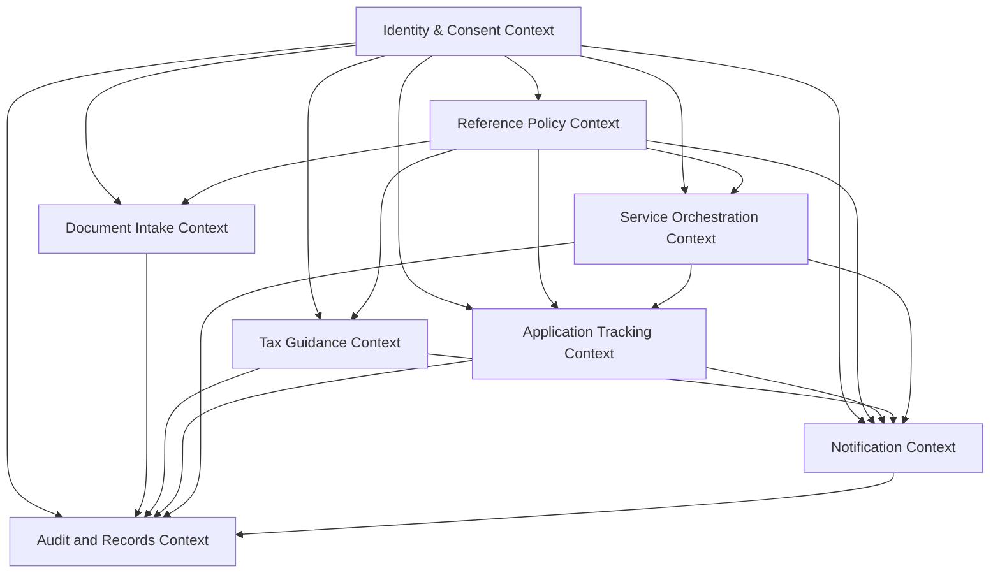
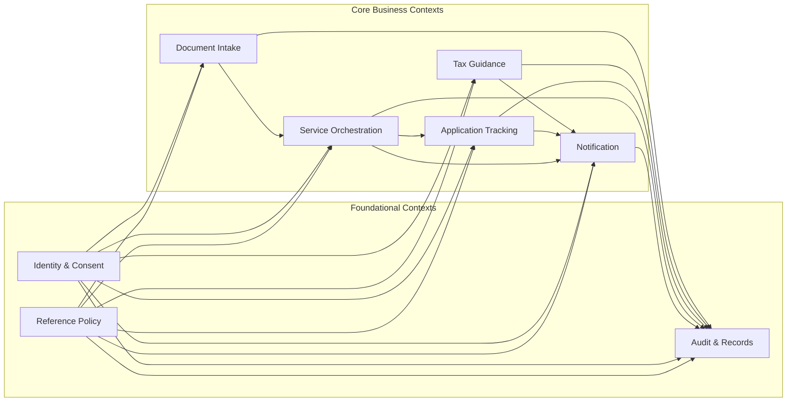

# Domain Model

## Project Context
This domain model is derived from the Nagarik App PRD for Nepal and uses Domain-Driven Design principles to identify business domains, bounded contexts, ownership boundaries, and recommended service boundaries.

## Modeling Principles
- Separate citizen-facing business capabilities from supporting policy and reference concerns.
- Align bounded contexts to business language, ownership, and change cadence.
- Prefer coarse-grained service boundaries that reflect clear domain ownership.
- Keep shared concepts explicit and limited to published contracts, not shared internal models.
- Treat agency-specific workflows, policy rules, and reference data as governed dependencies rather than generic platform concerns.

## Executive View
The solution has five primary citizen-facing business capabilities and several supporting domains.

Primary domains:
- Citizenship Document Intake
- Tax Estimation and Guidance
- Application Tracking
- Cross-Agency Service Orchestration
- Citizen Notifications

Supporting domains:
- Citizen Identity and Consent
- Government Service Catalog and Reference Policy
- Audit, Records, and Compliance

## Domain Inventory

### 1. Citizen Identity and Consent
**Domain type:** Supporting / foundational domain

**Responsibilities**
- Maintain the citizen identity reference used across services.
- Manage authentication-linked identity assurance outcomes.
- Capture consent, lawful basis acknowledgments, and notification preferences where policy allows.
- Provide the citizen profile context needed for downstream service journeys.

**Core entities**
- Citizen
- Identity Reference
- Identity Assurance Result
- Consent Record
- Communication Preference
- Authorization Scope

**Ownership boundaries**
- Owns citizen-facing identity profile data and preference records within Nagarik App.
- Does not own national identity issuance or source-of-truth registry records.
- Does not own agency-specific eligibility logic or application outcomes.

**Dependencies**
- National identity and authentication sources
- Policy on consent and lawful basis
- Notification and service journey contexts
- Privacy and records-retention rules

**Recommended bounded context**
- Identity & Consent Context

---

### 2. Citizenship Document Intake
**Domain type:** Core domain

**Responsibilities**
- Capture document images from citizens.
- Extract and present key fields from citizenship documents.
- Support manual correction and resubmission.
- Manage document submission history and verification support for eligible services.

**Core entities**
- Document Capture
- Citizenship Document
- Extracted Field Set
- Extraction Review
- Document Submission
- Scan Quality Assessment

**Ownership boundaries**
- Owns the user journey for scanning, reviewing, and submitting citizenship documents.
- Does not own legal identity issuance rules or document format standards.
- Does not own agency service eligibility or case processing outcomes.

**Dependencies**
- Document format and field-definition policy
- Identity and consent context
- Eligible service application contexts
- Support and escalation process

**Recommended bounded context**
- Document Intake Context

---

### 3. Tax Estimation and Guidance
**Domain type:** Core domain

**Responsibilities**
- Calculate indicative tax amounts for approved tax categories.
- Explain the basis of an estimate in citizen-friendly language.
- Present due dates, obligations, and approved payment guidance.
- Retain estimate history and support revisit of prior estimates.

**Core entities**
- Tax Estimate
- Tax Obligation
- Tax Category
- Calculation Rule Snapshot
- Due Date
- Payment Guidance
- Estimate Disclosure

**Ownership boundaries**
- Owns tax estimation and advisory guidance presented in Nagarik App.
- Does not own authoritative tax assessment, filing, or treasury settlement systems.
- Does not own payment rail execution or bank-led transaction processing.

**Dependencies**
- Tax policy and rate schedules
- Taxpayer identity linkage
- Approved payment channels
- Notification context for reminders
- Legal disclosure and confidentiality policy

**Recommended bounded context**
- Tax Guidance Context

---

### 4. Application Tracking
**Domain type:** Core domain

**Responsibilities**
- Present application status, milestones, and next actions.
- Expose tracking references and history for eligible applications.
- Translate agency workflow states into citizen-readable status language.
- Support support-desk lookup and citizen visibility.

**Core entities**
- Application
- Tracking Reference
- Status Timeline
- Milestone
- Action Required Flag
- Status Label
- Service Eligibility Flag

**Ownership boundaries**
- Owns citizen-visible tracking presentation and status history.
- Does not own agency internal case management workflow engines.
- Does not own the adjudication or approval decision itself.

**Dependencies**
- Agency case or workflow systems
- Status taxonomy and mapping rules
- Identity linkage to application owner
- Notification context for status updates

**Recommended bounded context**
- Application Tracking Context

---

### 5. Cross-Agency Service Orchestration
**Domain type:** Core domain / coordinating domain

**Responsibilities**
- Coordinate multi-agency service journeys.
- Reuse verified data where policy permits.
- Orchestrate handoffs between agency service steps.
- Track what was shared, when, and under what basis.
- Keep the citizen aware of participating agencies and remaining steps.

**Core entities**
- Service Journey
- Service Step
- Handoff
- Reused Data Package
- Sharing Authorization
- Participating Agency
- Progress Checkpoint

**Ownership boundaries**
- Owns the citizen-visible orchestration of a cross-agency service journey.
- Does not own the internal execution logic of each participating agency.
- Does not own agency data sources; it brokers governed reuse only.

**Dependencies**
- Agency participation agreements
- Data-sharing policy and legal basis
- Identity and consent context
- Government service catalog and reference policy
- Application tracking and notifications for status propagation

**Recommended bounded context**
- Service Orchestration Context

---

### 6. Citizen Notifications
**Domain type:** Core domain

**Responsibilities**
- Present a single inbox for official government notifications.
- Classify notices by urgency and purpose.
- Link notices to relevant services or applications.
- Maintain delivery and read history.
- Support citizen preferences where policy permits.

**Core entities**
- Notification
- Notification Category
- Delivery Record
- Read Receipt
- Notification Thread
- Linked Service Record
- Priority Indicator

**Ownership boundaries**
- Owns the citizen notification inbox and notice presentation.
- Does not own the source business event that triggered the notice.
- Does not own external delivery networks or device-specific messaging behavior.

**Dependencies**
- Application tracking events
- Tax guidance reminders
- Service orchestration events
- Communication preferences
- Notice standards and retention rules

**Recommended bounded context**
- Notification Context

---

### 7. Government Service Catalog and Reference Policy
**Domain type:** Supporting / reference domain

**Responsibilities**
- Maintain approved service definitions, eligibility labels, status taxonomies, document types, and notification categories.
- Provide governed reference values used by all citizen-facing domains.
- Control vocabulary consistency across agencies and journeys.

**Core entities**
- Service Definition
- Service Category
- Status Taxonomy
- Document Type
- Notification Category
- Tax Category
- Agency Participation Rule

**Ownership boundaries**
- Owns reference vocabularies and approval state.
- Does not own transaction execution or citizen records.
- Changes must be governed because they affect many contexts.

**Dependencies**
- Policy owners and agency administrators
- Legal and regulatory approvals
- All core business domains

**Recommended bounded context**
- Reference Policy Context

---

### 8. Audit, Records, and Compliance
**Domain type:** Supporting / compliance domain

**Responsibilities**
- Record who accessed, changed, submitted, or shared sensitive information.
- Preserve auditable histories for submissions, notices, estimates, and data-sharing events.
- Support retention, complaint handling, and oversight.

**Core entities**
- Audit Event
- Access Log
- Submission Record
- Retention Rule
- Compliance Flag
- Evidence Package

**Ownership boundaries**
- Owns immutable audit and compliance evidence.
- Does not own operational business decisions.
- Must observe regulatory retention and deletion constraints from the relevant legal framework.

**Dependencies**
- All business domains
- Records management policy
- Security policy
- Oversight and complaint workflows

**Recommended bounded context**
- Audit and Records Context

## Bounded Contexts
The following bounded contexts are recommended for implementation and governance:

1. Identity & Consent Context
2. Document Intake Context
3. Tax Guidance Context
4. Application Tracking Context
5. Service Orchestration Context
6. Notification Context
7. Reference Policy Context
8. Audit and Records Context

## Domain Map

### Domain Map Interpretation
- Identity and consent is a foundation for all citizen interactions.
- Reference policy supplies controlled vocabularies and approved categories to every citizen-facing context.
- The five core business domains own their own language, workflows, and records.
- Audit and records is a cross-cutting compliance domain that receives events from all domains.
- Notifications are event-driven from other domains but remain a separate business context because citizens experience them as a distinct service.

## Context Map

### Context Relationships
- Identity & Consent acts as an upstream supporting context for all user-facing flows.
- Reference Policy is a shared upstream context that publishes governed vocabularies; downstream contexts should not duplicate its authority.
- Document Intake publishes submitted documents and extracted citizen-confirmed data to eligible consuming contexts.
- Tax Guidance publishes estimates and due-date advisories to Notification and Audit contexts.
- Application Tracking publishes status events to Notification and Audit contexts.
- Service Orchestration coordinates handoffs and reuses governed data from Document Intake, Identity & Consent, and Reference Policy.
- Notification consumes events from Tax Guidance, Application Tracking, and Service Orchestration, but it owns the citizen inbox experience.

## Recommended Service Boundaries

### 1. Identity Service
**Scope**
- Citizen identity reference
- Consent records
- Communication preferences

**Why this boundary**
- Identity and consent change more slowly than transactional service journeys.
- Multiple other services depend on a stable identity and permission model.

**Boundary rule**
- Do not embed identity or consent state inside other service domains beyond references and snapshots.

### 2. Document Intake Service
**Scope**
- Capture session
- Extraction review
- Document submission
- Document history for eligible cases

**Why this boundary**
- Document intake has distinct rules, lifecycle, and quality checks.
- It should remain separate from application processing and case status.

**Boundary rule**
- Do not let application-tracking or service-orchestration services own document capture state.

### 3. Tax Guidance Service
**Scope**
- Estimate creation
- Calculation disclosures
- Payment guidance
- Reminder eligibility

**Why this boundary**
- Tax rules and explanation logic are specialized and policy-driven.
- Payment guidance is advisory and should not be merged into generic notifications.

**Boundary rule**
- Do not couple tax estimates directly to treasury settlement or bank execution logic.

### 4. Application Tracking Service
**Scope**
- Tracking reference lookup
- Status timeline
- Citizen-readable milestone translation
- Support-desk visibility

**Why this boundary**
- Status is a distinct citizen need and must stay understandable even if agency workflows change.

**Boundary rule**
- Do not expose agency internal workflow state as the domain model; publish mapped citizen statuses only.

### 5. Service Orchestration Service
**Scope**
- Cross-agency journey coordination
- Handoff sequencing
- Reused data packaging
- Progress checkpointing

**Why this boundary**
- Cross-agency journeys require explicit ownership because they cross institutional lines.
- This is a coordinating domain rather than a simple UI flow.

**Boundary rule**
- Do not let any participating agency own the whole orchestration model; each agency owns its own step, while the orchestration service owns the journey.

### 6. Notification Service
**Scope**
- Official inbox
- Notice categorization
- Delivery record
- Read state

**Why this boundary**
- Notifications are a distinct citizen contract and must be governed separately from the event sources that trigger them.

**Boundary rule**
- Do not place notification content generation rules inside each source domain as an ad hoc concern; publish a notification request into the notification context.

### 7. Reference Policy Service
**Scope**
- Service definitions
- Status taxonomy
- Document types
- Notification categories
- Tax categories

**Why this boundary**
- Shared vocabulary must be controlled centrally or governance will fragment across domains.

**Boundary rule**
- Downstream domains may consume reference values, but they must not redefine authoritative policy vocabularies locally.

### 8. Audit and Records Service
**Scope**
- Immutable logs
- Retention and evidence
- Access traceability

**Why this boundary**
- Compliance requirements span all domains but should be implemented as a dedicated recordkeeping context.

**Boundary rule**
- Avoid storing audit evidence only inside the operational domain that produced it.

## Domain Ownership Summary
| Domain | Primary Owner | Business Purpose |
|---|---|---|
| Identity and Consent | Central Nagarik platform governance | Citizen identity linkage, consent, preferences |
| Document Intake | Citizen service product owner | Citizenship document capture and extraction |
| Tax Guidance | Revenue/tax product owner | Tax estimation and payment assistance |
| Application Tracking | Service operations owner | Citizen-visible application progress |
| Service Orchestration | Cross-agency service governance body | Multi-agency journeys and data reuse |
| Notification | Platform communication owner | Official citizen notices |
| Reference Policy | Government policy and standards owner | Shared vocabulary and approved categories |
| Audit and Records | Compliance and records owner | Traceability, retention, oversight |

## Suggested Aggregates
The following aggregates are recommended as a starting point for domain design:

- Citizen aggregate in Identity & Consent
- DocumentCapture aggregate in Document Intake
- TaxEstimate aggregate in Tax Guidance
- ApplicationTracking aggregate in Application Tracking
- ServiceJourney aggregate in Service Orchestration
- Notification aggregate in Notification
- ReferenceDefinition aggregate in Reference Policy
- AuditEvent aggregate in Audit and Records

## Notes on Strategic Classification
- Core domains: Document Intake, Tax Guidance, Application Tracking, Service Orchestration, Notification
- Supporting domains: Identity and Consent, Reference Policy, Audit and Records
- Generic/platform capabilities are intentionally not modeled here because the PRD does not define them as business differentiators.

## Recommendation
Treat the five PRD capabilities as separate core bounded contexts, with Identity & Consent, Reference Policy, and Audit & Records as governed supporting contexts. Use explicit contracts between contexts and avoid a shared database or shared domain model across them.
