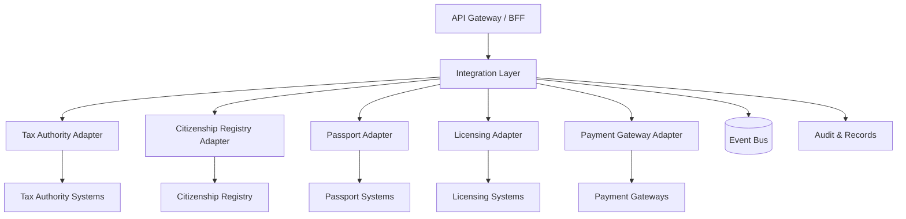
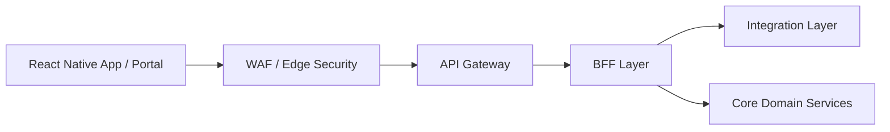
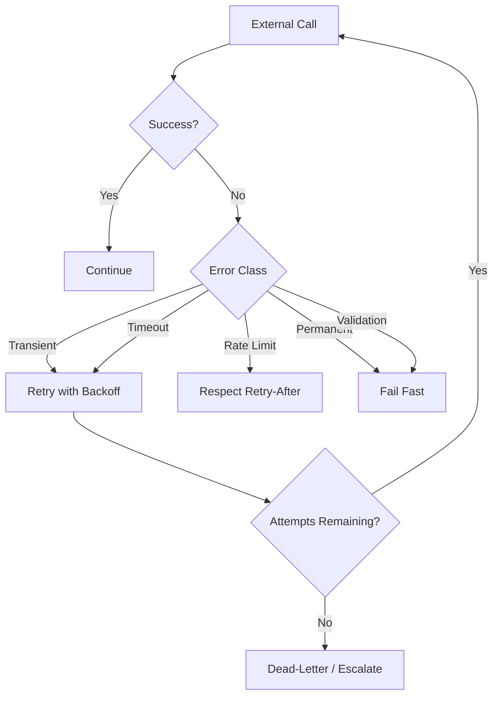
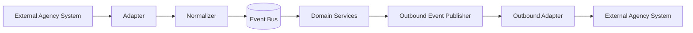

# Integration Architecture

## Purpose
This document defines the government integration layer for the Nagarik App platform. It covers integration with:
- Tax authority systems
- Citizenship registry
- Passport systems
- Licensing systems
- Payment gateways

The architecture is designed to support agencies with different API standards, including REST, SOAP, file-based exchange, and event-driven systems, while preserving security, traceability, and operational resilience.

## Design Goals
- Integrate heterogeneous government systems without coupling them to internal domain models.
- Support synchronous and asynchronous integrations.
- Provide retry, recovery, and reconciliation mechanisms for unreliable upstream systems.
- Enforce strong security, authentication, and authorization across agency boundaries.
- Preserve auditability for every request, response, and business event.
- Scale horizontally and remain highly available.

## Integration Principles
- Use an anti-corruption layer between external systems and internal services.
- Prefer contract adapters over direct vendor-specific calls in domain services.
- Normalize all external responses into canonical internal events and DTOs.
- Use idempotent operations for create and submit actions.
- Treat external systems as partially unreliable and design for timeout, retry, and compensation.
- Use asynchronous processing when agencies cannot guarantee low-latency responses.
- Separate business logic from protocol translation.

---

# 1. Adapter Architecture

## Adapter Layer Overview
The integration layer should be implemented as a dedicated government integration service tier composed of adapters, translators, workflow coordinators, and message handlers.

## Adapter Types
### REST Adapter
Used when an external agency exposes JSON REST endpoints.
- Handles HTTP methods, status codes, pagination, and request signing.
- Maps agency schemas to canonical internal schemas.
- Supports idempotency keys and retry-safe operations.

### SOAP Adapter
Used when an external agency exposes legacy XML/SOAP services.
- Handles XML serialization and deserialization.
- Maps SOAP faults to canonical integration errors.
- Supports WS-Security, signed envelopes, and request tracing.

### File-Based Adapter
Used when an agency exchanges CSV, XML, or JSON files over SFTP, object storage, or secure batch transfer.
- Produces outbound files from canonical events.
- Consumes inbound files and validates schema, checksum, and signature.
- Supports scheduled reconciliation and batch acknowledgments.

### Event Adapter
Used when an agency publishes or consumes events through a broker or message exchange.
- Converts inbound agency events to canonical platform events.
- Publishes outbound integration events using versioned schemas.
- Supports dead-letter queues and replay.

### Hybrid Adapter
Used where an agency supports a mix of APIs and batch exchange.
- Reads real-time status through API.
- Complements missing updates through batch reconciliation.

## Canonical Integration Model
All external responses should be normalized to a canonical model with these shared concepts:
- agency_code
- external_reference
- correlation_id
- citizen_identity_reference
- service_code
- transaction_status
- timestamp
- payload_signature
- source_system_version

## Adapter Responsibilities
- Protocol translation
- Schema mapping
- Authentication handshake
- Retry classification
- Error normalization
- Trace propagation
- Response validation
- Result publication to internal services

---

# 2. API Gateway Architecture

## Role of the Gateway
The API gateway is the controlled entry point for mobile, web, support, and service-to-service traffic. It does not perform business orchestration itself. Its job is to enforce edge security, route requests, shape responses, and keep integrations isolated from the client.

## Gateway Capabilities
- Authentication and token validation
- Request throttling and burst protection
- Route selection by service and version
- Response shaping for client and admin views
- Correlation ID injection
- Request size enforcement
- API version routing
- Tenant and agency context propagation

## Gateway Pattern

## Routing Rules
- Citizen-facing requests should route through the BFF.
- Support and administrative requests should route through restricted internal APIs.
- External integration callbacks should terminate at the integration layer, not at domain services.
- Versioned APIs must be routed by path or header versioning policy.

## Gateway Security Controls
- Mutual TLS for service-to-service calls.
- OAuth2/OIDC for citizen and staff access.
- JWT validation and scope enforcement.
- Rate limiting per client, agency, and endpoint.
- IP allowlisting for agency callbacks where required.
- WAF rules for injection, payload abuse, and bot mitigation.

## Versioning Strategy
- Use URI versioning for public APIs, for example `/v1/`.
- Use header or contract version negotiation for agency-facing adapters when the external system requires it.
- Retain old versions until migration windows close.

---

# 3. Supported Agency Standards

## REST
- JSON over HTTPS
- OpenAPI-first contract definition
- Idempotency keys for create and submit actions
- Cursor or limit-offset pagination
- Standard HTTP status codes

## SOAP
- XML over HTTPS
- WSDL-based contract management
- WS-Security where required
- Fault translation into canonical error responses

## File-Based Exchange
- CSV, XML, JSON, or zipped payloads
- Secure SFTP or object storage transfer
- Checksum and signature verification
- Batch acknowledgment and reconciliation

## Event-Driven Exchange
- Versioned event schemas
- At-least-once delivery semantics
- Idempotent consumers
- Dead-letter queues for poison messages

## Legacy or Mixed Standards
- Use protocol-specific adapter modules behind a common integration interface.
- Never allow external protocol details to leak into domain services.

---

# 4. Retry Mechanisms

## Retry Policy
Retries must be policy-driven and classified by error type.

## Retry Categories
### Transient Errors
Examples:
- Network interruption
- Temporary upstream unavailability
- DNS or TLS handshake issue
- Short-lived overload

Retry behavior:
- Exponential backoff with jitter
- Bounded maximum attempts
- Circuit breaker integration

### Rate-Limited Errors
Examples:
- HTTP 429
- Agency throttling headers
- Payment gateway limits

Retry behavior:
- Honor `Retry-After` or equivalent backoff guidance
- Queue work if immediate retry is not allowed

### Permanent Errors
Examples:
- Validation failure
- Invalid citizen reference
- Unsupported transaction state
- Schema mismatch

Retry behavior:
- Do not retry automatically
- Surface to user or operations as a deterministic failure

### Ambiguous Errors
Examples:
- Timeout after request possibly reached upstream
- Partial response received

Retry behavior:
- Use idempotency key and reconciliation before retrying
- Prefer status query before resubmission

## Backoff Policy
- First retry: short delay
- Subsequent retries: exponential backoff with jitter
- Maximum retry window should be bounded by business SLA
- No infinite retry loops

## Idempotency Requirements
- Every create or submit endpoint must accept an idempotency key.
- The integration layer must persist request fingerprint and response reference.
- Retries must not create duplicate applications, payments, or notices.

---

# 5. Error Recovery

## Recovery Model
The integration layer should recover through a combination of retry, reconciliation, compensation, and manual intervention.

## Recovery Patterns
### Reconciliation
Use when an upstream response is uncertain.
- Query authoritative status endpoint.
- Compare internal request record with external transaction state.
- Update internal state only after confirmation.

### Compensation
Use when a downstream action succeeded but the internal workflow failed.
- Create a compensating event.
- Flag for support review if compensation is not possible.

### Replay
Use when a message or batch file failed temporarily.
- Requeue the message.
- Replay from dead-letter queue after correction.

### Manual Recovery
Use when business confirmation is needed.
- Route to support or operations.
- Preserve the failed payload and correlation IDs.
- Require a reason code for reprocessing.

## Recovery States
- pending
- in_progress
- awaiting_reconciliation
- retry_scheduled
- dead_lettered
- compensated
- resolved

## Operational Recovery Requirements
- Every failed integration must be visible in an operations dashboard.
- Operators must be able to search by citizen reference, external reference, or correlation ID.
- Recovery actions must be audit logged.
- Failed records must not be lost.

---

# 6. Event Handling

## Event Flow
The integration layer acts as a bridge between external systems and internal domain events.

## Event Types
- External status received
- External application acknowledged
- Payment confirmed
- Payment failed
- Identity verified
- Registry record updated
- Appointment scheduled
- Appointment missed
- Batch reconciliation completed
- Integration error raised

## Event Rules
- Events must be versioned.
- Events must include correlation and causation identifiers.
- Consumers must be idempotent.
- Event payloads should be minimal and canonical.
- Replayed events must be safe to process more than once.

## Event Ordering
- Ordering must be guaranteed only where business semantics require it.
- For workflows, order should be preserved per external reference or citizen reference.
- For notifications and audit, eventual ordering is acceptable if sequence is preserved by correlation ID.

## Dead-Letter Handling
- Invalid or repeatedly failing events move to a dead-letter queue.
- Dead-letter items require manual review or automated repair before replay.
- Replay actions must be logged and authenticated.

---

# 7. Security Controls

## Security Objectives
- Protect citizen data in transit and at rest.
- Prevent unauthorized agency access.
- Ensure non-repudiation for integration transactions.
- Provide traceability for all external and internal messages.

## Security Controls
### Transport Security
- TLS for all integrations.
- mTLS for service-to-service and agency-to-agency trusted communication.
- Certificate rotation and trust-store management.

### Identity and Access Management
- OAuth2/OIDC where supported.
- Signed service tokens for machine-to-machine calls.
- Role-based and scope-based authorization.
- Agency-specific access policies.

### Message Security
- Payload signing for high-trust exchange.
- Checksum validation for batch files.
- Schema validation before processing.
- PII minimization in logs and events.

### Data Protection
- Encrypt persisted integration records.
- Store secrets in a dedicated secrets manager.
- Mask sensitive fields in dashboards and logs.
- Limit retention of temporary payload copies.

### Audit and Monitoring
- Log every request and response metadata envelope.
- Track actor, agency, correlation ID, and external reference.
- Forward security events to SIEM.
- Alert on repeated failures, replay storms, or unauthorized access.

## Access Segmentation
- Separate citizen-facing, internal operations, and agency integration credentials.
- Use per-agency credentials and scopes rather than shared credentials.
- Apply network segmentation between public edge, integration tier, and internal services.

---

# 8. Canonical Integration Flow

## Example Flow: Payment Gateway Confirmation
1. Citizen initiates a payment from the app.
2. The payment request is routed through the gateway to the integration layer.
3. The payment adapter submits the request to the selected gateway.
4. The adapter stores the idempotency key and correlation ID.
5. The gateway returns an acknowledgment or pending state.
6. A payment confirmation event arrives asynchronously.
7. The integration layer normalizes the event and publishes it to the event bus.
8. Downstream services update the citizen journey and notifications.
9. Audit receives the full trace.

## Example Flow: Citizenship Registry Lookup
1. Workflow engine requests identity verification data.
2. The integration layer routes to the citizenship registry adapter.
3. The adapter resolves the agency protocol and translates the response.
4. The response is normalized to a canonical identity verification result.
5. If the registry is unavailable, the request is queued for retry or reconciliation.
6. Audit records the lookup and result.

---

# 9. Reliability and Performance

## Reliability Targets
- High availability for the integration tier.
- No single point of failure in protocol adapters.
- Horizontally scalable stateless adapter workers.
- Durable queueing for asynchronous agency interactions.

## Performance Strategies
- Cache stable reference mappings.
- Use connection pooling for high-volume REST integrations.
- Use asynchronous processing for slow external systems.
- Compress batch payloads where supported.
- Avoid synchronous dependency chains across multiple agencies.

## Capacity Strategy
- Scale adapters independently by agency and protocol.
- Separate high-volume payment and status workloads from low-volume administrative exchanges.
- Use per-agency backpressure so one slow agency does not affect the entire platform.

---

# 10. Operational Model

## Monitoring
- Request success rate by agency and protocol
- Retry rate and retry success rate
- Dead-letter queue depth
- Mean latency by adapter
- Reconciliation backlog
- External system availability
- Security anomaly count

## Support Model
- Each agency integration should have an ownership team and an escalation contact.
- Support tooling should allow search by external reference, internal correlation ID, citizen ID, and transaction date.
- Manual recovery actions require reason codes and approval logs.

## Deployment Model
- Adapters should be deployable independently.
- Agency-specific configuration should be externalized.
- Protocol and schema changes should be versioned.
- Outbound and inbound paths should be isolated to reduce blast radius.

---

# 11. Architecture Decisions
| Decision | Rationale |
|---|---|
| Use a dedicated integration layer instead of direct service-to-agency calls | Keeps domain services clean and prevents protocol coupling. |
| Use protocol-specific adapters behind a common interface | Supports agencies with different API standards without duplicating business logic. |
| Normalize all external data to canonical events and DTOs | Simplifies downstream processing and reduces schema drift. |
| Use idempotency keys and reconciliation for transactional calls | Prevents duplication when retries or timeouts occur. |
| Use dead-letter queues for repeated failures | Preserves failed items for recovery and audit. |
| Separate synchronous APIs from asynchronous event handling | Improves resilience and handles slow government systems safely. |
| Apply strong mTLS, OAuth2/OIDC, and payload signing where possible | Meets government security expectations for sensitive data exchange. |

## Summary
The proposed integration layer provides a secure, scalable, and protocol-agnostic way to connect Nagarik App services with external government systems and payment providers. It supports heterogeneous agency standards, resilience under failure, and complete auditability without leaking external complexity into domain services.
