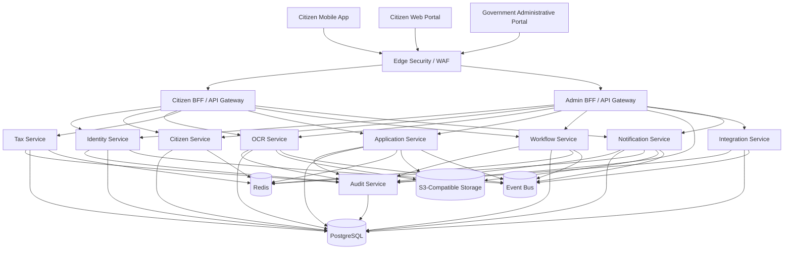
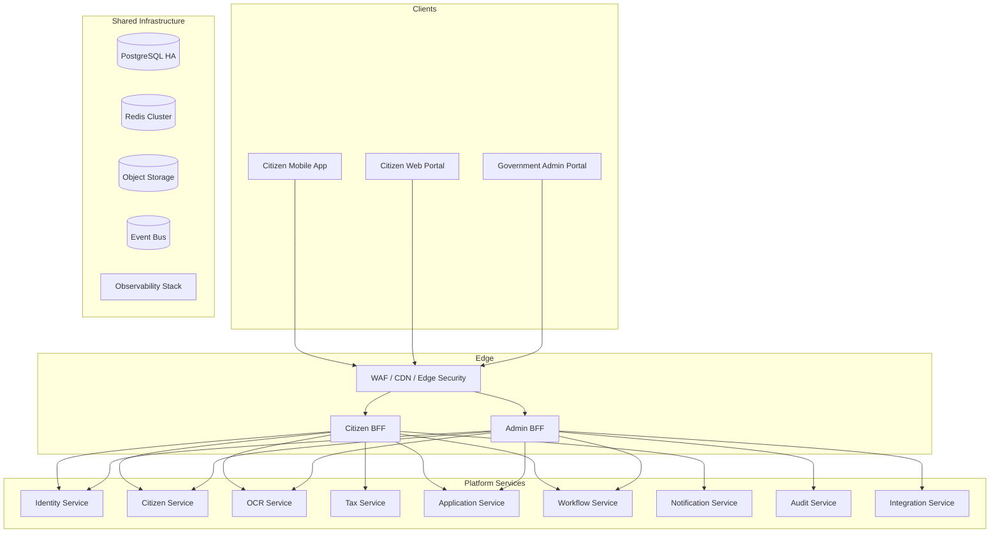
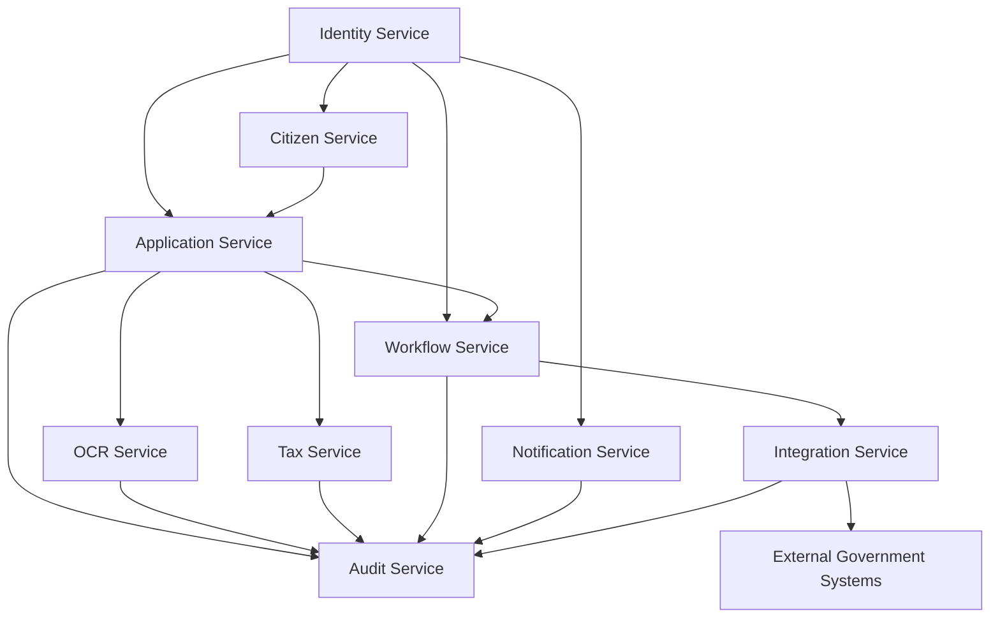
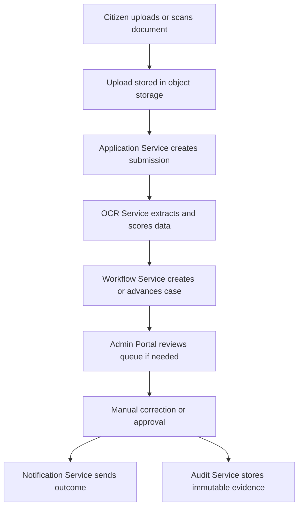
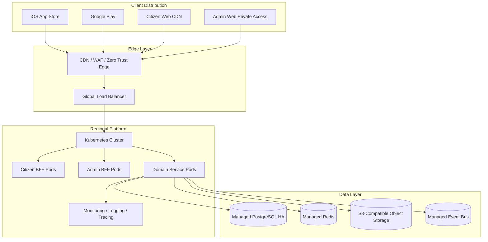

# SARATHI Platform Architecture

## Source of Truth
This document supersedes the earlier mobile-centric architecture notes and becomes the canonical architecture for the SARATHI digital government platform.

## Scope
The platform must support:
- Citizen Mobile App for iOS and Android
- Citizen Web Portal
- Government Administrative Portal
- Shared backend platform
- Shared AI/OCR services
- Shared workflow engine
- Shared integration layer

## Correction to Prior Assumptions
The previous architecture incorrectly treated the system as a mobile-only application. The corrected architecture removes that assumption and introduces a platform-first design with three client surfaces and one shared backend ecosystem.

Incorrect assumptions corrected here:
- A single React Native client was the primary user surface.
- The API gateway only needed to shape mobile-friendly payloads.
- Support and administrative access could be treated as a portal add-on.
- Notification delivery was centered only on the mobile app.
- Shared types and client contracts were scoped only to mobile use cases.
- Authorization could be modeled implicitly around citizen app sessions.
- API design did not clearly separate citizen-facing and administrative operations.
- The data model did not explicitly model staff roles, administrative actions, and portal-specific audit needs.

## Platform Requirements

### Citizen Mobile App
Capabilities:
- Authentication
- Citizenship scanning
- Tax estimation
- Application submission
- Application tracking
- Notifications
- Document storage
- Offline support where feasible

### Citizen Web Portal
Capabilities:
- All mobile features
- Full document upload
- Application management
- Tax dashboard
- Downloadable records
- Accessibility compliance
- Multi-language support

### Government Administrative Portal
Capabilities:
- Application review
- Workflow management
- Citizen verification
- OCR verification
- Manual overrides
- Audit review
- Analytics dashboards
- Agency-specific views
- User and role management

### Shared Backend Platform
Design services usable by all clients:
- Identity Service
- Citizen Service
- OCR Service
- Tax Service
- Application Service
- Workflow Service
- Notification Service
- Audit Service
- Integration Service

No business logic belongs in client applications.

## Corrected Architecture Principles
- Keep all business rules, decisioning, and orchestration in backend services.
- Treat the web portal and admin portal as first-class clients, not extensions of mobile.
- Separate citizen-facing API surfaces from administrative API surfaces.
- Use shared design tokens and component libraries across all client apps.
- Centralize identity, authorization, audit, and integration concerns.
- Use asynchronous processing for OCR, workflow transitions, and external government calls.
- Maintain strong separation between operational data and immutable audit records.
- Use object-level authorization for documents, applications, and workflow tasks.
- Design every service to support multi-agency routing and scope filtering.

## Recommended Technology Stack

### Citizen Mobile App
- React Native
- Expo managed workflow or bare workflow if native modules require it
- TypeScript
- TanStack Query for server state
- Zustand for local UI state
- React Hook Form and Zod for form validation
- Secure storage for refresh tokens and device-bound secrets

### Citizen Web Portal
- Next.js with React and TypeScript
- Shared design system components from the monorepo
- TanStack Query for server state
- React Hook Form and Zod
- i18next for language switching
- CDN-hosted static assets where possible

### Government Administrative Portal
- Next.js with React and TypeScript
- Shared design system plus admin-specific components
- TanStack Query for server state
- Role-aware route guards and server-side authorization checks
- Charting and case-management components for operations dashboards
- Stronger step-up authentication and session controls than citizen surfaces

### Shared UI and Client Strategy
- Shared design system package for tokens, layout primitives, typography, icons, forms, tables, and empty states
- Shared API client package generated from OpenAPI for citizen and admin portals
- Shared validation schemas for form and payload consistency
- Platform-specific wrappers for mobile gestures, web accessibility, and admin-density layouts
- No business decisioning in UI components

### State Management Strategy
- Server state: TanStack Query across all clients
- Local UI state: Zustand or equivalent lightweight store
- Form state: React Hook Form
- App shell state: authentication, selected agency, locale, and feature flags
- Do not duplicate domain state in client stores beyond transient UI needs

### Authentication Flow
- Use OIDC with PKCE for web and mobile clients
- Use short-lived access tokens and rotated refresh tokens
- Use secure session cookies only for web portal interactions if an edge session model is needed
- Require MFA and step-up authentication for administrative operations, manual overrides, exports, and user management
- Put all authentication enforcement in backend and edge services, not in client-side code

### API Communication Layer
- Citizen clients call citizen BFF endpoints only
- Administrative portal calls admin BFF endpoints only
- BFFs aggregate domain calls and shape responses for each client surface
- Service-to-service calls remain internal and use mTLS plus service identity
- Large document uploads should use presigned URLs and confirmation callbacks instead of pushing files through client-to-service JSON payloads

### Internationalization and Accessibility
- Provide locale bundles for Nepali, English, and additional future languages
- Store locale preference in identity or citizen profile data, not only in client state
- Citizen web and admin portals must target WCAG 2.1 AA or better
- Mobile must use native accessibility labels, focus order, readable contrast, and screen-reader support
- Avoid layout assumptions that only work on one screen size or input method

## Authorization Model

### Roles
- Citizen
- Government Clerk
- Department Reviewer
- Department Manager
- System Administrator
- Super Administrator

### Permission Matrix
| Capability | Citizen | Government Clerk | Department Reviewer | Department Manager | System Administrator | Super Administrator |
|---|---:|---:|---:|---:|---:|---:|
| View own profile and records | Yes | No | No | No | No | No |
| Submit applications | Yes | No | No | No | No | No |
| Upload and manage documents | Yes | No | No | No | No | No |
| View own tax estimates | Yes | No | No | No | No | No |
| View own notifications | Yes | No | No | No | No | No |
| Track own applications | Yes | No | No | No | No | No |
| Review assigned applications | No | Yes | Yes | Yes | No | No |
| Verify identity and OCR output | No | Yes | Yes | Yes | No | No |
| Edit case notes and request resubmission | No | Yes | Yes | Yes | No | No |
| Perform manual overrides | No | No | Yes | Yes | No | No |
| Reassign or escalate cases | No | No | Yes | Yes | No | No |
| View audit logs within agency scope | No | Limited | Yes | Yes | Yes | Yes |
| Run analytics dashboards | No | Limited | Yes | Yes | Yes | Yes |
| Manage roles and access assignments | No | No | No | No | Yes | Yes |
| Manage reference data and configuration | No | No | No | No | Yes | Yes |
| Manage all agencies and system policy | No | No | No | No | No | Yes |

### Authorization Rules
- Citizen access is always object-scoped to owned records or explicitly shared records.
- Clerks can act only within assigned queues and agency scope.
- Reviewers can validate, request correction, and approve within delegated authority.
- Managers can override, reassign, and approve escalations within their agency scope.
- System Administrators manage platform configuration and user lifecycle but should not have unrestricted access to citizen content by default.
- Super Administrators have the broadest authority and must be tightly controlled, audited, and periodically reviewed.
- Administrative access requires step-up authentication and explicit audit logging.

## Corrected System Architecture

### Context Diagram

### Container Diagram

### Service Diagram

### Data Flow Diagram

### Deployment Diagram

## Corrected Backend Architecture

### Edge and BFF Tier
- Provide a citizen BFF for mobile and citizen portal traffic.
- Provide an admin BFF for privileged government operations.
- Keep both BFFs stateless and thin.
- Use BFFs for aggregation, shaping, pagination, and orchestration only.
- Enforce route-level and token-scope separation between citizen and administrative APIs.

### Shared Backend Services
| Service | Responsibility | Primary Clients |
|---|---|---|
| Identity Service | Authentication, identity linkage, consent, roles, sessions | All clients and services |
| Citizen Service | Citizen profile, household, contact points, language prefs, user-facing records | Citizen BFF, Admin BFF |
| OCR Service | Document preprocessing, extraction, confidence scoring, fraud checks | Application Service |
| Tax Service | Tax estimation, rule-driven calculation, explanation traces | Citizen BFF, Admin BFF |
| Application Service | Submission intake, document references, case records, application history | All clients |
| Workflow Service | State machines, assignments, escalations, SLAs, task queues | All clients, Integration Service |
| Notification Service | Citizen inbox, outbound notices, channel preferences, delivery status | All clients |
| Audit Service | Immutable audit trail, access logs, evidence packages | All services, Admin BFF |
| Integration Service | Cross-agency adapters, canonical mapping, retries, reconciliation | Workflow Service, Application Service |

### Service Boundary Corrections
- Document intake belongs in the Application Service, not as a separate citizen-only domain.
- Service orchestration belongs in the Workflow Service and Integration Service, not as a client-facing control layer.
- OCR is a shared platform capability used by application intake and administrative verification flows.
- Citizen profile data should be owned by Citizen Service, not spread across client session stores.
- Administrative review actions, overrides, and queue operations must be explicit domain actions with audit events.

### API Surface Corrections
- Citizen-facing APIs support mobile and web.
- Administrative APIs support privileged staff operations only.
- Shared internal service APIs remain private to the platform.
- The OpenAPI spec should be partitioned by surface and audience, not by device.

## Corrected Database Strategy

### Core Database Principles
- Keep PostgreSQL as the transactional system of record.
- Maintain one schema per bounded context or service ownership domain.
- Add explicit RBAC tables and admin-action audit tables.
- Preserve UUID primary keys, snake_case naming, soft delete, and audit fields.
- Use partial indexes for active records and queue work.
- Avoid cross-service foreign keys unless the service intentionally owns the same schema namespace.

### Required Schema Corrections

#### Identity Schema
Add or ensure:
- `identity.users`
- `identity.user_identities`
- `identity.roles`
- `identity.permissions`
- `identity.user_roles`
- `identity.role_permissions`
- `identity.sessions`
- `identity.consents`
- `identity.notification_preferences`

#### Citizen Schema
Add or ensure:
- `citizen.citizen_profiles`
- `citizen.contact_points`
- `citizen.language_preferences`
- `citizen.households`
- `citizen.saved_documents`

#### Application Schema
Add or ensure:
- `application.applications`
- `application.application_documents`
- `application.application_events`
- `application.application_assignments`
- `application.application_comments`
- `application.application_snapshots`

#### Workflow Schema
Add or ensure:
- `workflow.workflow_definitions`
- `workflow.workflow_instances`
- `workflow.workflow_tasks`
- `workflow.workflow_transitions`
- `workflow.workflow_escalations`
- `workflow.workflow_sla_breaches`

#### Notification Schema
Add or ensure:
- `notification.notification_threads`
- `notification.notification_messages`
- `notification.delivery_attempts`
- `notification.channel_preferences`

#### Audit Schema
Add or ensure:
- `audit.audit_events`
- `audit.access_logs`
- `audit.evidence_packages`
- `audit.retention_rules`

#### Integration Schema
Add or ensure:
- `integration.external_systems`
- `integration.integration_endpoints`
- `integration.integration_jobs`
- `integration.webhook_deliveries`
- `integration.reconciliation_runs`

### Database Review Conclusion
The current schema direction is broadly correct for auditability and multi-agency support, but it must be expanded to include explicit client-surface support, staff RBAC, administrative actions, and application ownership entities. The biggest correction is to make role, permission, session, and case-assignment data first-class rather than inferred.

## Corrected API Strategy

### API Design Rules
- Use OpenAPI 3.1 for all external surfaces.
- Version by path, not by host header.
- Partition APIs by audience:
  - citizen-facing APIs
  - administrative APIs
  - private internal service APIs
- Use idempotency keys for submit, approve, reject, payment, and external handoff operations.
- Use cursor pagination for high-volume lists.
- Use presigned uploads for documents.
- Return download links only after authorization checks.
- Include audit correlation identifiers in every sensitive response.

### Citizen-Facing API Examples
- `POST /api/v1/citizen/auth/exchange`
- `GET /api/v1/citizen/me`
- `GET /api/v1/citizen/applications`
- `POST /api/v1/citizen/applications`
- `GET /api/v1/citizen/applications/{id}`
- `POST /api/v1/citizen/applications/{id}/documents`
- `GET /api/v1/citizen/notifications`
- `GET /api/v1/citizen/tax/estimate`

### Administrative API Examples
- `GET /api/v1/admin/work-queue`
- `GET /api/v1/admin/applications/{id}`
- `POST /api/v1/admin/applications/{id}/assign`
- `POST /api/v1/admin/applications/{id}/approve`
- `POST /api/v1/admin/applications/{id}/reject`
- `POST /api/v1/admin/ocr/{id}/verify`
- `POST /api/v1/admin/ocr/{id}/override`
- `GET /api/v1/admin/audit/search`
- `GET /api/v1/admin/analytics/dashboards`
- `POST /api/v1/admin/users`
- `POST /api/v1/admin/roles`

### Internal Service API Examples
- `POST /internal/applications`
- `POST /internal/workflow/events`
- `POST /internal/ocr/jobs`
- `POST /internal/integration/dispatch`

### API Review Conclusion
The API layer must no longer be designed as a mobile BFF alone. It must explicitly serve three audiences with distinct scopes, payload shapes, and authorization policies.

## Corrected Security Architecture

### Core Security Controls
- OIDC with PKCE for citizen web and mobile clients
- MFA and step-up authentication for all privileged admin operations
- Short-lived tokens with refresh rotation and revocation support
- mTLS between services
- WAF, bot mitigation, and rate limiting on all public surfaces
- Object-level authorization on every document, workflow, and application record
- Strong input validation, upload scanning, and file type enforcement
- Encryption in transit and at rest for all sensitive data stores
- Secrets management outside application code and container images

### OCR Fraud Prevention
- Preserve original upload artifacts and capture provenance metadata
- Compute file hashes and device/session fingerprints where legally permitted
- Perform image normalization and tamper detection before extraction
- Route low-confidence or suspicious documents to manual review
- Record every OCR correction and override in audit

### Administrative Access Controls
- Separate citizen access from staff access at the token, route, and UI level
- Require explicit agency and queue scope for staff users
- Use privileged access workflows for super administrator actions
- Log all staff searches, exports, edits, overrides, and approval actions
- Periodically recertify roles and entitlements

### Auditability
- Append-only audit logs
- Correlation IDs across edge, service, and integration layers
- Immutable evidence packages for material transactions
- Separate audit access from operational administration
- Tamper-evident storage policies for retained evidence

### API Abuse Prevention
- Per-user and per-device rate limiting
- Upload size and type limits
- Anomaly detection for repeated failed lookups or case enumeration
- Idempotency for create and transition operations
- Anti-automation controls for public forms and search endpoints

## Corrected Deployment Architecture

### Production Deployment
- Mobile apps distributed through app stores or government device management channels
- Citizen web portal hosted behind CDN, WAF, and global load balancing
- Administrative portal hosted on a restricted edge with zero-trust access and tighter policies
- Backend services deployed in Kubernetes or equivalent managed container platform
- PostgreSQL deployed as managed HA with multi-AZ failover and backup/restore policies
- Redis deployed as managed clustered cache
- Object storage used for documents, evidence, and exports
- Event bus used for asynchronous workflows and notifications
- Monitoring, logging, and tracing centralized across all surfaces

### Scaling Posture
- Horizontal autoscaling for edge and service tiers
- Read-heavy optimization for citizen dashboard and tracking traffic
- Separate scaling policies for admin and citizen traffic classes
- Async queues for OCR, notifications, and integrations
- Capacity planning for millions of citizens with burst handling for policy events, deadlines, and public campaigns

### Observability
- Metrics: request rate, latency, error rate, queue depth, OCR confidence, workflow backlog, admin overrides
- Logging: structured, correlation-rich, PII-minimized
- Tracing: edge-to-service distributed traces for all high-value workflows
- Alerting: SLA breach detection, integration failure detection, auth anomalies, OCR fraud spikes

## Migration Recommendations
1. Rename the architecture framing from mobile application to digital government platform.
2. Split the single mobile-centric client model into mobile, citizen web, and admin portal surfaces.
3. Introduce separate citizen and administrative BFF/API surfaces.
4. Add explicit Citizen Service and Application Service ownership boundaries.
5. Move document intake responsibilities into the application intake flow and keep OCR as a shared service.
6. Add first-class RBAC tables and administrative action logs to the database model.
7. Regenerate the OpenAPI contract so citizen and admin APIs are explicitly partitioned.
8. Update security policy and test cases to cover step-up auth, staff abuse, OCR fraud, and object-level authorization.
9. Update deployment plans to include web hosting, restricted admin access, and observability across all surfaces.
10. Treat the earlier mobile-centric documents as superseded design history, not current source of truth.

## Final Architecture Statement
SARATHI is a multi-surface digital government platform. All client experiences, whether mobile, web, or administrative, are thin presentation layers over a shared backend platform that owns identity, citizen records, OCR, tax calculation, application processing, workflow, notifications, audit, and integration logic.
